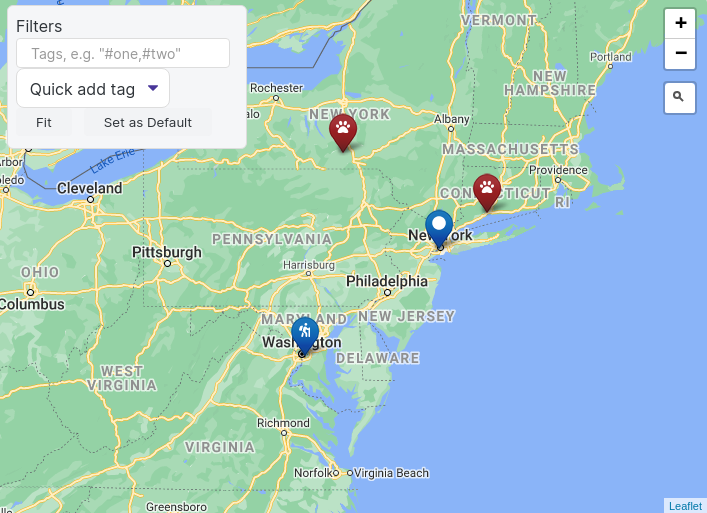
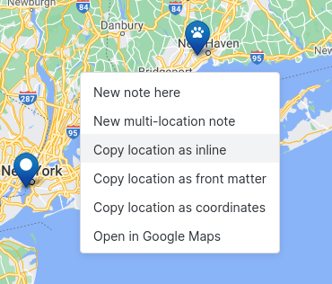

# Obsidian.md Map View

## Intro

This plugin introduces an **interactive map view** for the [Obsidian.md](https://obsidian.md/) editor.
It searches your notes for encoded geolocations (see below) and places them as markers on a map.  

You can set different icons for different note types, filter the displayed notes and much more.




This plugin is in preliminary stages, but its guiding philosophy and goal is to provide a **personal GIS system** as a complementary view for your notes.
I wrote it because I wanted my ever-growing Zettelkasten to be able to answer questions like...

- If I'm visiting somewhere, what interesting places do I know in the area?
- If I'm planning a trip, what is the geographical relation between the points?

And many more.

Just like the Obsidian graph view lets you visualize associative relations between some of your notes, the map view lets you visualize geographic ones.

## Disclaimer

This plugin has a lot of potential for growth; it can have many more useful features (and hopefully eventually it will).
It can also be much more visually polished and much easier to use.

However, it is the result of just a few restless evenings on which I wanted to quickly build a solution to a problem that I had.
I will not be able to give it the attention it deserves to fulfill its full potential, because it requires a lot more work.
I'm sure many will have great ideas for taking it to the next level, but unfortunately I don't expect to have the availability required for that, so at this point feature request will mostly have to go unattended.

I believe that it can be useful enough for many users as-is, and I hope that as the user base grows, a few developers will pitch in to help continue the vision.

## Limitations

- Although both light & dark themes are supported, the map itself is currently only light.
- Was not yet tested & adapted to Obsidian Mobile.

## User Guide

### Parsing Location Data

The plugin scans all your notes and parses two types of location data.

First is a location tag in a note's [front matter](https://help.obsidian.md/Advanced+topics/YAML+front+matter):

```yaml
---
location: [40.6892494,-74.0466891]
---
```

This is useful for notes that represent a single specific location.
It's also compatible with the way other useful plugins like [obsidian-leaflet](https://github.com/valentine195/obsidian-leaflet-plugin) read locations, and allows some interoperability.

Another way that the plugin parses location data is through inline `` `location` `` markers within notes (note the backticks), which allow multiple markers in the same note.
To prevent the need to scan the full content of all your notes, it requires an empty `locations:` tag in the note front matter ('locations' and not 'location').
Example:

```
---
locations:
---

# Trip Plan

Point 1: Hudson River
`location: 42.277578,-76.1598107`
... more note content ...

Point 2: New Haven
`location: 41.2982672,-72.9991356`
```

Notes with multiple markers will contain multiple markers on the map with the same note name, and clicking on the marker will jump to the correct location within the note.

Notice how locations in the front matter must contain brackets (`location: [lat, lng]`) and inline locations do not (`location: lat, lng`).
For inline locations both formats are supported, but for the front matter brackets are mandatory because it needs to compny with the YAML format.

### Finding a Location

If you want to log a location in a note, I recommend one of two ways.



1. Use one of the "copy location as..." options when you right-click the map. If you use "copy location as inline", just remember you need the note to start with a front matter that has an empty `locations:` line.

2. Search from something in Google Maps then copy the latitude & longitude parts of the URL, e.g. if you search for "statue of liberty" you get to a link that looks like this: `https://www.google.com/maps/place/Statue+of+Liberty+National+Monument/@40.6892494,-74.0466891,17z/data=!3m1!4b1!4m5!3m4!1s0x89c25090129c363d:0x40c6a5770d25022b!8m2!3d40.6892494!4d-74.0445004`. From that you can take the location: `40.6892494,-74.0466891`.


### Filtering by Tags

At the time of release, this plugin provides just one way to filter notes: an "OR" search by tags.

Your notes are encouraged to contain Obsidian tags that represent their type (e.g. `#hike`, `#food`, `#journal-entry` or whatever you'll want to filter by).
In the search box you can type tags separated by commas and you'll get in your view just the notes that have one of these tags.

Since this method has a single-note granularity, there is currently no way to see just a few locations inlined in the same note.
If a note's tag is included in the search, all the locations within this note will be displayed on the map.

### Marker Icons

Although there isn't yet a friendly way in the GUI to configure this, the plugin allows you to selectively apply icons to notes based on a powerful rules system.

To understand how this works you'll first have to refer to the [Leaflet.ExtraMarkers](https://github.com/coryasilva/Leaflet.ExtraMarkers#icons) package and use icon names from [Font Awesome](https://fontawesome.com/).

A single marker is defined in the following JSON structure:
`{"prefix": "fas", "icon": "fa-bus", "shape": "circle", "color": "red"}`

To build this, I searched Font Awesome (in the link above) for 'bus' and chose [this icon](https://fontawesome.com/v5.15/icons/bus?style=solid).
A Font Awesome icon has a style prefix (in this case `fas`) and an icon name that always starts with `fa`, in this case `fa-bus`.
Shape and color are for your choosing.

#### Tag Rules

To apply an icon to a note with geolocation data, Map View scans a list of rules.
You can edit these rules through the plugin configuration, which currently includes a not-so-friendly JSON dictionary that you need to carefully edit.
Please don't do that if you're unfamiliar with the JSON syntax, if you wait a while I'm sure that a better GUI will be built :)

Map View scans the rules and applies them one by one, always starting from `default` and then from first to last. A rule matches if the tag that it lists is included in the note, and then the rule's fields will overwrite the corresponding fields of the previous matching rules, until all rules were scanned.
This allows you to set rules that change just some properties of the icons, e.g. some rules change the shape according to some tags, some change the color etc.

Here's the example I provide as a probably-not-useful default in the plugin:

```json
	{
		"default": {"prefix": "fas", "icon": "fa-circle", "markerColor": "blue"},
		"#trip": {"prefix": "fas", "icon": "fa-hiking", "markerColor": "green"},
		"#trip-water": {"prefix": "fas", "markerColor": "blue"},
		"#dogs": {"prefix": "fas", "icon": "fa-paw"},
	}
```

This means that all notes will have a blue `fa-circle` icon by default.
However, a note with the `#trip` tag will have a green `fa-hiking` icon.
Then, a note that has both the `#trip` and `#trip-water` tags will have a `fa-hiking` marker (when the `#trip` rule is applied), but a **blue** marker, because the `#trip-water` overwrites the `markerColor` that the previous `#trip` rule has set.

**Consider copying the configuration to an external editor and editing it there.**
The configuration dialog ignores an invalid JSON object, so if you close it in a state that has a syntax error, your changes will be lost.

### Map Sources

By default, Map View uses the [standard tile layer of OpenStreetMap](https://wiki.openstreetmap.org/wiki/Standard_tile_layer).
However, you can change the map source in the configuration to any service that has a tiles API using a standard URL syntax.

There are many services of localized, specialized or just beautifully-rendered maps that you can use, sometimes following a free registration.
See a pretty comprehensive list [here](https://wiki.openstreetmap.org/wiki/Tiles).

Although that's the case with this plugin in general, it's worth noting explicitly that using 3rd party map data properly, and making sure you are not violating any terms of use, is your own responsibility.

Note that Google Maps is not in that list, because although it does provide the same standard form of static tiles in the same URL format, the Google Maps terms of service makes it difficult to legally bundle the maps in an application.

## Relation to Other Obsidian Plugins

When thinking about Obsidian and maps, the first plugin that comes to mind is [Obsidian Leaflet](https://github.com/valentine195/obsidian-leaflet-plugin).
That plugin is great at rendering maps based on data within a note, with great customization options.
It can also scan for data inside a directory which gives even more power.
In contrast, Obsidian Map View is focused on showing and interacting with your notes geographically.

Another relevant plugin is [Obsidian Map](https://github.com/Darakah/obsidian-map) which seems to focus on powerful tools for map drawing.

## Wishlist

As noted in the disclaimer above, my wishlist for this plugin is huge and I'm unlikely to get to it all.
There are so many things that I want it to do, and so little time...

- **Most importantly**: proper mobile support including device location if possible. That's literally on the top of my list.
- More powerful filtering. I'd love it to be based on the [existing Obsidian query format](https://github.com/obsidianmd/obsidian-api/issues/22). What I see in mind is a powerful text search with a results pane that's linked to the map.
- Better interoperability with Obsidian Leaflet: support for marker image files, locations as an array and `marker` tags.
- Better UI, especially for the core functionality like editing icons.
- Dark mode.
- A side bar with note summaries linked to the map view.

## Changelog

### 0.0.8

- Fixed [a bug](https://github.com/esm7/obsidian-map-view/issues/12) allowing to confusingly add markers out of earth's proper bounds.
- "New note here" right-click option with configuration options.
- Markers now updated dynamically when relevant notes are added/deleted/modified.
- Tweaks to opening notes in a 2nd pane (be able to use a 2nd pane if it already existed).
- When jumping to a location within a note, the corresponding note line is now highlighted.
- "Open in Google Maps" menu item within notes with locations (both note menu and right-click on a location).

### 0.0.7

Tiny fix to an annoying bug of the default not being applied.

### 0.0.6

Small fixes before the plugin formal release.

### 0.0.5

- New "show on map" menu item in the editor.
- Fixed a nasty compatibility issue with obsidian-leaflet, see [here](https://github.com/esm7/obsidian-map-view/issues/6).

### 0.0.4

- Added settings (and Ctrl key) to open a note in a separate pane (https://github.com/esm7/obsidian-map-view/issues/3).

### 0.0.3

- Proper view and state management (hopefully).
- Fixed a bug in location parsing.

### 0.0.2

Various cleanups, better copyright handling and generally more readiness for releasing the plugin.

### 0.0.1

Initial alpha release.

