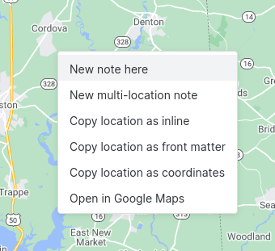
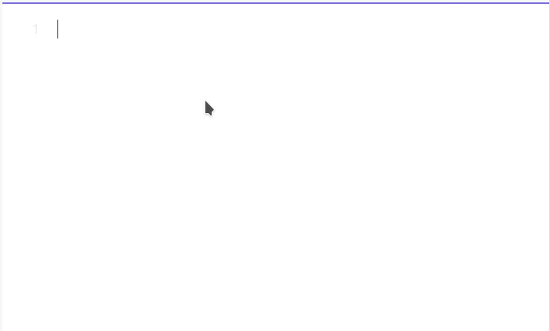

# Obsidian.md Map View

## Intro

This plugin introduces an **interactive map view** for the [Obsidian.md](https://obsidian.md/) editor.
It searches your notes for encoded geolocations (see below) and places them as markers on a map.  

You can set different icons for different note types, filter the displayed notes and much more.


The plugin's guiding philosophy and goal is to provide a **personal GIS system** as a complementary view for your notes.
I wrote it because I wanted my ever-growing Zettelkasten to be able to answer questions like...

- If I'm visiting somewhere, what interesting places do I know in the area?
- If I'm planning a trip, what is the geographical relation between the points?

And many more.

Just like the Obsidian graph view lets you visualize associative relations between some of your notes, the map view lets you visualize geographic ones.

## Limitations

- Although both light & dark themes are supported, the map itself is currently only light.
- Experience in mobile is not as good as it should be. Most notably there's no GPS location support due to permission limitations of the Obsidian app. Please help us ask the Obsidian developers to get these permissions added!

## User Guide

### Parsing Location Data

The plugin scans all your notes and parses two types of location data.

First is a location tag in a note's [front matter](https://help.obsidian.md/Advanced+topics/YAML+front+matter):

```yaml
---
location: [40.6892494,-74.0466891]
---
```

This is useful for notes that represent a single specific location.
It's also compatible with the way other useful plugins like [obsidian-leaflet](https://github.com/valentine195/obsidian-leaflet-plugin) read locations, and allows some interoperability.

Another way that the plugin parses location data is through **inline location URLs** in the format of `[link-name](geo:40.68,-74.04)`, which allow multiple markers in the same note.
To prevent the need to scan the full content of all your notes, it requires an empty `locations:` tag in the note front matter ('locations' and not 'location').
Example:

```
---
locations:
---

# Trip Plan

Point 1: [Hudson River](geo:42.277578,-76.1598107)
... more note content ...

Point 2: [New Haven](geo:41.2982672,-72.9991356)
```

Notes with multiple markers will contain multiple markers on the map with the same note name, and clicking on the marker will jump to the correct location within the note.

For many cases inline locations are superior because `geo:` is a [native URL scheme](https://en.wikipedia.org/wiki/Geo_URI_scheme), so if you click it in Obsidian (including mobile), your default maps app (or an app selector for a location) will be triggered.
The front matter method, however, is currently better if you want interoperability with plugins that use it.

Inline locations also support **inline tags** in the format of `tag:dogs`. For example:

```
Point 1: [Hudson River](geo:42.277578,-76.1598107) tag:dogs
```

This will add the tag `#dogs` specifically to that point, regardless of the note's own tags.
This is useful for notes that contain tags of different types (e.g. a trip log with various types of locations).
Note that the `tag:` format should be used **without** the `#` sign, because this sets the tag for the whole note.
Map View will add `#` for the purpose of setting marker icons, as explained below.
Also note that inline tags do not affect the files that are searched based on the entered search query, so in the example above, if you enter '#dogs' in the search box, your note would **not** appear.

Note: older versions of this plugin used the notation `location: ...` for inline locations.
This notation is still supported but the standard `geo:` one is the default and encouraged one.

### Adding a Location to a Note

If you want to log a location in a note, you have a few options.

1. Starting from the map: use "new note here" when right-clicking the map. This will create a new note (based on the template you can change in the settings) with the location you clicked.



Note that the map can be searched using the tool on the upper-right side.


2. While writing/editing a note: create a geolocation link in the format of `[](geo:)`, and if you start typing inside the link name (the brackets), Map View will initiate a location search. If you confirm one of the options, it will fill-in the location's coordinates. See more on this in the "In-Note Location Search" section below.

To make this more streamlined, Map View adds to Obsidian a command named Insert Geolocation which you can map to a keyboard shortcut.

3. If you have a location in some other mapping service that you wish to log, e.g. from Google Maps, you can copy the URL from that service, right-click in your note and select "Paste as Geolocation". The supported services are configurable, see below for more details.

4. If you prefer to edit it manually, use one of the "copy geolocation" options when you right-click the map. If you use "copy geolocation", just remember you need the note to start with a front matter that has an empty `locations:` line.
 


### Filtering by Tags

At the time of release, this plugin provides just one way to filter notes: an "OR" search by tags.

Your notes are encouraged to contain Obsidian tags that represent their type (e.g. `#hike`, `#food`, `#journal-entry` or whatever you'll want to filter by).
In the search box you can type tags separated by commas and you'll get in your view just the notes that have one of these tags.

Alternatively, if you follow an inline geolocation link by `tag:#yourTagName`, this tag will be added to that geolocation in addition to the note's tags.

### Marker Icons

Map View allows you to customize notes' map marker icons based on a powerful rules system. These rules can be edited using the plugin's settings pane or edited as JSON for some even more fine-grained control.

Icons are based on on [Font Awesome](https://fontawesome.com/), so to add a marker icon you'll need to find its name in the Font Awesome catalog.
Additionally, there are various marker properties (shape, color and more) that are based on [Leaflet.ExtraMarkers](https://github.com/coryasilva/Leaflet.ExtraMarkers#properties).

To change the map marker icons for your notes, go to the Map View settings and scroll to Marker Icon Rules.

A single marker is defined with a *tag pattern* and *icon details*.
The tag pattern is usually a tag name (e.g. `#dogs`), but it can also be with a wildcard (e.g. `#trips/*`).
Icon details are a few properties: icon name (taken from the Font Awesome catalog), color and shape.


A single marker is defined in the following JSON structure:
`{"prefix": "fas", "icon": "fa-bus", "shape": "circle", "color": "red"}`

To add a marker with a bus icon, click New Icon Rule, search Font Awesome (in the link above) for 'bus', choose [this icon](https://fontawesome.com/v5.15/icons/bus?style=solid), then see that its name is `fa-bus`.
Once you enter `fa-bus` in the icon name, you should immediately see your icon in the preview.
To make this icon apply for notes with the `#travel` tag, type `#travel` in the Tag Name box.

#### Tag Rules

To apply an icon to a note with geolocation data, Map View scans the complete list of rules by their order, always starting from `default`.
A rule matches if the tag that it lists is included in the note, and then the rule's fields will overwrite the corresponding fields of the previous matching rules, until all rules were scanned.
This allows you to set rules that change just some properties of the icons, e.g. some rules change the shape according to some tags, some change the color etc.

Here's the example I provide as a probably-not-useful default in the plugin:

```json
	{ruleName: "default", preset: true, iconDetails: {"prefix": "fas", "icon": "fa-circle", "markerColor": "blue"}},
	{ruleName: "#trip", preset: false, iconDetails: {"prefix": "fas", "icon": "fa-hiking", "markerColor": "green"}},
	{ruleName: "#trip-water", preset: false, iconDetails: {"prefix": "fas", "markerColor": "blue"}},
	{ruleName: "#dogs", preset: false, iconDetails: {"prefix": "fas", "icon": "fa-paw"}},
```

This means that all notes will have a blue `fa-circle` icon by default.
However, a note with the `#trip` tag will have a green `fa-hiking` icon.
Then, a note that has both the `#trip` and `#trip-water` tags will have a `fa-hiking` marker (when the `#trip` rule is applied), but a **blue** marker, because the `#trip-water` overwrites the `markerColor` that the previous `#trip` rule has set.

Tag rules also support wildcards, e.g. a rule in the form of `"#food*": {...}` will match notes with the tag `#food`, `#food/pizza`, `#food/vegan`, `#food-to-try` etc.

The settings also allow advanced users to manually edit the configuration tree, and there you can use more properties based on the [Leaflet.ExtraMarkers](https://github.com/coryasilva/Leaflet.ExtraMarkers#properties) properties. Manual edits update the GUI in real-time.

### In-Note Location Search & Auto-Complete

Map View adds an Obsidian command named Insert Inline Location, that you can (and encouraged) to map to a keyboard shortcut, e.g. `Ctrl+L` or `Ctrl+Shift+L`.
This command inserts an empty inline location template: `[](geo:)`.

When editing an inline location in this format, whether if you added it manually or using the command, if you start entering a link name, Map View will start offering locations based on a geocoding service.
Selecting one of the suggestions will fill-in the coordinates of the chosen locations, *not* change your link name (assuming you prefer your own name rather than the formal one offered by the geocoding service), and jump the cursor to beyond the link so you can continue typing.



If your note is not yet marked as one including locations (by a `locations:`) tag in the front matter, this is added automatically.

#### Changing a Geocoding Provider

By default, Map View is configured to use OpenStreetMap as the search provider.
If you prefer to use the Google Maps search, you can configure this in the plugin settings.

The Google Geocoding API is practically free or very cheap for normal note-taking usage, but you'd need to setup a project and obtain an API key from Google.
See [here](https://developers.google.com/maps/documentation/javascript/get-api-key) for more details.

**Note:** usage of any geocoding provider is at your own risk, and it's your own responsibility to verify you are not violating the service's terms of usage.

### Map Sources

By default, Map View uses the [standard tile layer of OpenStreetMap](https://wiki.openstreetmap.org/wiki/Standard_tile_layer).
However, you can change the map source in the configuration to any service that has a tiles API using a standard URL syntax.

There are many services of localized, specialized or just beautifully-rendered maps that you can use, sometimes following a free registration.
See a pretty comprehensive list [here](https://wiki.openstreetmap.org/wiki/Tiles).

Although that's the case with this plugin in general, it's worth noting explicitly that using 3rd party map data properly, and making sure you are not violating any terms of use, is your own responsibility.

Note that Google Maps is not in that list, because although it does provide the same standard form of static tiles in the same URL format, the Google Maps terms of service makes it difficult to legally bundle the maps in an application.

### Open In

Many context menus of Map View display a customizable Open In list, which can open a given location in external sources.
These sources can be Google Maps, OpenStreetMap, specialized mapping tools or pretty much anything you use for viewing locations.


The Open In list is shown:
- When right-clicking on the map.
- When right-clicking a marker on the map.
- When right-clicking a line in a note that has a location.
- In the context menu of a note that has a front matter location.

This list can be edited through the plugin's settings menu, with a name that will be displayed in the context menus and a URL pattern. The URL pattern has two parameters -- `{x}` and `{y}` -- that will be replaced by the latitude and longitude of the clicked location.


Popular choices may be:
- Google Maps: `https://maps.google.com/?q={x},{y}`
- OpenStreetMap: `https://www.openstreetmap.org/#map=16/{x}/{y}` (replace `16` with your preferred zoom level)
- Waze (online dropped pin): `https://ul.waze.com/ul?ll={x}%2C{y}&navigate=yes&zoom=17` (replace `17` with your preferred zoom level)

And you can figure out many other mapping services just by inspecting the URL.

## Relation to Other Obsidian Plugins

When thinking about Obsidian and maps, the first plugin that comes to mind is [Obsidian Leaflet](https://github.com/valentine195/obsidian-leaflet-plugin).
That plugin is great at rendering maps based on data within a note, with great customization options.
It can also scan for data inside a directory which gives even more power.
In contrast, Obsidian Map View is focused on showing and interacting with your notes geographically.

Another relevant plugin is [Obsidian Map](https://github.com/Darakah/obsidian-map) which seems to focus on powerful tools for map drawing.

## Wishlist

As noted in the disclaimer above, my wishlist for this plugin is huge and I'm unlikely to get to it all.
There are so many things that I want it to do, and so little time...

- More powerful filtering. I'd love it to be based on the [existing Obsidian query format](https://github.com/obsidianmd/obsidian-api/issues/22). What I see in mind is a powerful text search with a results pane that's linked to the map.
- Better interoperability with Obsidian Leaflet: support for marker image files, locations as an array and `marker` tags.
- Dark mode.
- A side bar with note summaries linked to the map view.

## Changelog

### 1.0.0

- UI revisions and cleanups to make it easier for new users. **Some changes break existing notions.**
  - Map View now treats "inline locations" as the default. It is first in the menus, and front matter actions are listed as "front matter".
  - "Copy as coordinates" was removed, believing it's not really useful anymore. Please drop me a note if you find it important.
  - Several other tweaks to make the plugin easier to use.
- At last, a settings UI for editing marker icons! Check it out under the plugin settings.
  - In order to do this, the rule format in the plugin's data file had to be changed. The plugin will auto-convert your existing rules to the new format when first launched. After this conversion, *do not* manually enter rules under the old key!
  - You may still edit rules manually, through the plugin's "edit marker icons as JSON" box or directly in the data file, but **only use the new key** `markerIconRules`.
- Added an inline geolocation search, which can get results from either OSM or Google (with an API key), and a command to insert a geolocation.
- With relation to the above, the search tool in the map can now use the selected geocoding service too, meaning you can use Google Maps to search for locations if you have an API key.
- New "paste as geolocation" and "convert to geolocation" right-click editor menu items, that can automatically convert URLs in the clipboard or URLs in the note to a geolocation link.
  - The rules that convert URLs to geolocations are configurable in the settings.

### 0.2.1

- Big upgrade hidden in a small version bump! Added support for marker clusters, with configurable cluster size. This makes Map View much more friendly (and better-performing) for big sets of markers.
- Small fix to a bug introduced in 0.2.0, of "show on map" not always working.

### 0.2.0

Many usability fixes and improvements.

- Added inline tags in the format of `tag:dogs` following an inline location. See documentation above for more details.
- Shift filter box down to avoid covering pane title (thanks @huy-vuong!) ([PR here](https://github.com/esm7/obsidian-map-view/pull/25))
- Fixed a confusing and possibly annoying default behavior of panning the map to view a popup (https://github.com/esm7/obsidian-map-view/issues/22)
- When clicking "Show on map" inside a note, use an existing map view if such is open (rather than always replacing the current view). Override (always replace current pane) by holding Ctrl.
- Added a customizable "open in" list. Instead of the old "Open in Google Maps", you can now add your own list of external mapping services.
- The map controls are now collapsible in order to make them less obstructive on mobile and to make room for more features.

### 0.1.0

- A new experimental geosearch functionality was added ("convert to location"), see documentation above.
- Small usability fixes that make the app better on mobile.
- The inline location format was changed to standard [geo URLs](https://en.wikipedia.org/wiki/Geo_URI_scheme), as pointed out by @D-side in [this issue](https://github.com/esm7/obsidian-map-view/issues/18). This is superior to the previous format in many ways:
  - These URLs are clickable and launch the default app or an app selection in desktop and mobile.
  - They make much more sense in Preview Mode.
  - They have a name, making something nicer to present in the note hover popup.

**The previous `location:` format is still supported for backwards compatibility,** but you are encouraged to convert your inline locations to enjoy the benefits of the new format.

If you're using Vim (the real one, not Obsidian's Vim mode), you can use a substitute command for each note with inline locations:
```
%s/`location:.*\[\(.*,.*\)]`/[](geo:\1)/g
```

(remove `\[` and `\]` if you were using the syntax without brackets)


### 0.0.9

- Marker hovers are now much nicer, and in the case of inline notes they also show the snippet around the location (configurable).
- Smoother view state management including a relevant [bug fix](https://github.com/esm7/obsidian-map-view/issues/14).
- Tag rules now supports wildcards in the tag name (as asked [here](https://github.com/esm7/obsidian-map-view/issues/10)).

### 0.0.8

- Fixed [a bug](https://github.com/esm7/obsidian-map-view/issues/12) allowing to confusingly add markers out of earth's proper bounds.
- "New note here" right-click option with configuration options.
- Markers now updated dynamically when relevant notes are added/deleted/modified.
- Tweaks to opening notes in a 2nd pane (be able to use a 2nd pane if it already existed).
- When jumping to a location within a note, the corresponding note line is now highlighted.
- "Open in Google Maps" menu item within notes with locations (both note menu and right-click on a location).

### 0.0.7

Tiny fix to an annoying bug of the default not being applied.

### 0.0.6

Small fixes before the plugin formal release.

### 0.0.5

- New "show on map" menu item in the editor.
- Fixed a nasty compatibility issue with obsidian-leaflet, see [here](https://github.com/esm7/obsidian-map-view/issues/6).

### 0.0.4

- Added settings (and Ctrl key) to open a note in a separate pane (https://github.com/esm7/obsidian-map-view/issues/3).

### 0.0.3

- Proper view and state management (hopefully).
- Fixed a bug in location parsing.

### 0.0.2

Various cleanups, better copyright handling and generally more readiness for releasing the plugin.

### 0.0.1

Initial alpha release.

