# Obsidian.md Map View

[](https://www.buymeacoffee.com/esm7)

## Intro

This plugin introduces an **interactive map view** for [Obsidian.md](https://obsidian.md/).
It searches your notes for encoded geolocations (see below), places them as markers on a map and offers multiple tools to interact with them.

It effectively turns your Obsidian vault into a **personal GIS system** that adds a geographical layer to your notes, journals, trip planning and pretty much anything you use Obsidian for.

You can set different icons for different note types according to custom rules, save geolocations from a variety of sources (Google Maps and many others), save custom views, switch between map layers, run powerful queries and so much more.

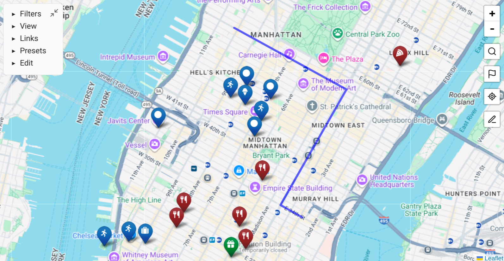

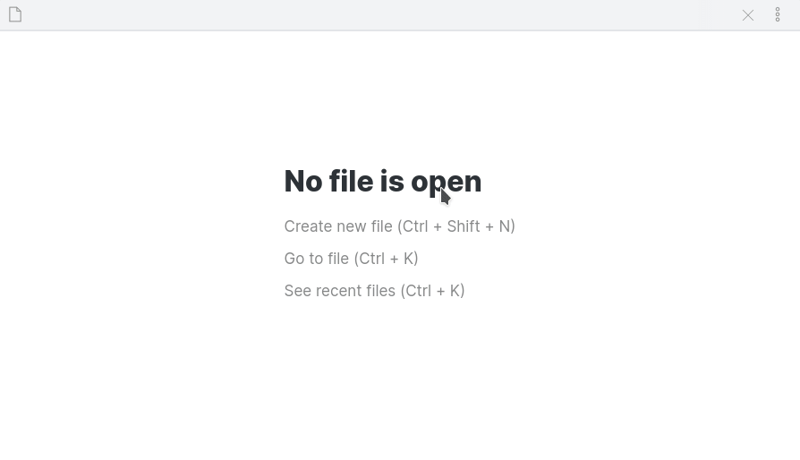

I wrote this plugin because I wanted my ever-growing Zettelkasten to be able to answer questions like...

-   When I get recommendations about cool places to visit, how do I save them in a way that I can recall later?
-   When I'm visiting somewhere, what interesting places do I know in the area?
-   When I'm conducting research for planning a trip, how do I lay out on a map options for places to eat, hike or sleep, combine them with prior knowledge, and save them for future reference?

Map View can integrate with your note-taking flow in order to answer all of these questions and much more.

Just like the Obsidian graph view lets you visualize associative relations between some of your notes, the map view lets you visualize geographic ones.

## With Obsidian Mobile

The main limitation of the plugin right now is that the Obsidian Mobile app has no location permission, so on mobile you cannot see your current location.

Please help us ask the Obsidian developers to get these permissions added, as it will make this plugin so much better!

## Support the Development

If you want to support the development of this plugin, please consider to [buy me a coffee](https://www.buymeacoffee.com/esm7).

## Parsing Location Data

Map View provides [several methods to log locations in notes](#adding-a-location-to-a-note) and can manage the technicalities for you.
You can skip to that section if you want to just get started, or continue reading the more technical explanation below.

**To clarify, you can use Map View without entering geolocations manually at all.**
You will, however, need to understand the difference between the front matter and the inline formats, and decide when to use which.

So, the plugin works by scanning your notes and parsing two types of location data.

First is a location tag in a note's [front matter](https://help.obsidian.md/Advanced+topics/YAML+front+matter):

```yaml
---
location: [40.6892494, -74.0466891]
---
```

This is useful for notes that represent a single specific location.
It's also compatible with the way other useful plugins like [obsidian-leaflet](https://github.com/valentine195/obsidian-leaflet-plugin) read locations, and allows some interoperability.

Another way that the plugin parses location data is through **inline location URLs** in the format of `[link-name](geo:40.68,-74.04)`, which allow multiple markers in the same note.
To prevent the need to scan the full content of all your notes, it requires an empty `locations:` tag in the note front matter ('locations' and not 'location').
Example:

```
---
locations:
---

# Trip Plan

Point 1: [Hudson River](geo:42.277578,-76.1598107)
... more note content ...

Point 2: [New Haven](geo:41.2982672,-72.9991356)
```

Notes with multiple markers will contain multiple markers on the map with the same note name, and clicking on the marker will jump to the correct location within the note.

For many cases inline locations are superior because `geo:` is a [native URL scheme](https://en.wikipedia.org/wiki/Geo_URI_scheme), so if you click it in Obsidian (including mobile), your default maps app (or an app selector for a location) will be triggered.
The front matter method, however, is currently better if you want interoperability with plugins that use it, if you want to store lots of filterable meta-data on a location, or if you heavily express yourself with links.

Inline locations also support **inline tags** in the format of `tag:dogs` (without the `#` sign). For example:

```
Point 1: [Hudson River](geo:42.277578,-76.1598107) tag:dogs
```

This will add the tag `#dogs` specifically to that point, regardless of the note's own tags.
This is useful for notes that contain tags of different types (e.g. a trip log with various types of locations).
Note that the `tag:` format should be used **without** the `#` sign, because this sets the tag for the whole note.
Map View will internally add `#` for the purpose of queries and marker icons, as explained below.

Multiple inline tags can be separated with a whitespace: `[](geo:42.2,-76.15) tag:dogs tag:trip`.

Multiple inline locations can be added in the same line, and the tags that follow them will be associated to the location on the left, but the right-click editor context menu will not know to choose the location that was selected.

## Adding a Location to a Note

Map View offers many ways to add geolocations to notes.

### Anywhere in Obsidian

Map View adds an Obsidian command named "New geolocation note", which you can map to a hotkey and use anywhere in Obsidian.

This opens a dialog on which you can search (address or location based on your [configured geocoding provider](#changing-a-geocoding-provider)) or paste a URL using the built-in or custom [URL parsing rules](#url-parsing-rules).

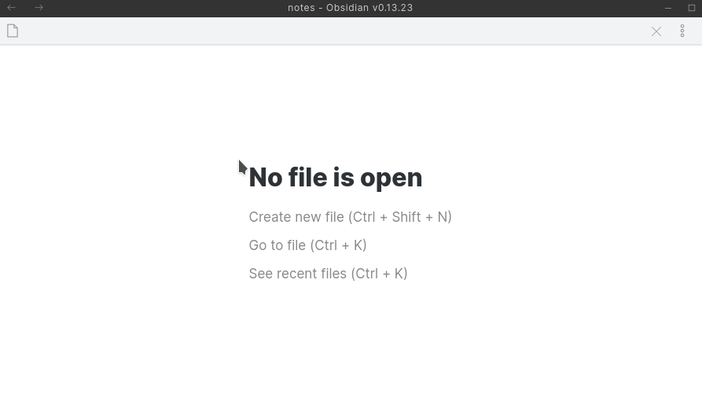

### In an Existing Note

There are multiple ways to add a geolocation to an existing note.

1. Create an inline geolocation link in the format of `[](geo:)`, and if you start typing inside the link name (the brackets), Map View will initiate a location search. If you confirm one of the options, it will fill-in the location's coordinates. See more on this in the ["In-Note Location Search"](#in-note-location-search--auto-complete) section below.

To make this more streamlined, Map View adds to Obsidian a command named 'Add inline geolocation link' which you can map to a keyboard shortcut.

2. Add a front matter geolocation by using the Obsidian command 'Add geolocation (front matter) to current note'. This opens the same dialog as "new geolocation note" which allows you to search for a location name or paste a [URL parsing rules](#url-parsing-rules).

3. If you have a geolocation in some other mapping service that you wish to log, e.g. from Google Maps, you can copy the URL or "lat,lng" geolocation from that service, right-click in your note and select "Paste as Geolocation". The supported services are configurable, see [below](#url-parsing-rules) for more details.

### From the Map

The map offers several tools to create notes.

1. Use "new note here" when right-clicking the map. This will create a new note (based on the template you can change in the settings) with the location that you clicked. You can create either an empty note with a front matter (single geolocation) or an empty note with an inline geolocation.

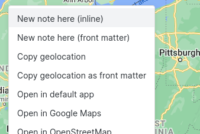

The map can be searched using the tool on the upper-right side, so you can quickly jump to the place you want to mark.
[URL parsing rules](#url-parsing-rules) also work here, so you can [copy a geolocation from Google Maps](#tips) (or any other service) and jump to it.


2. If you prefer to enter geolocations as text, use one of the "copy geolocation" options when you right-click the map and paste them in a note. If you use "copy geolocation", just remember you need the note to start with a front matter that has an empty `locations:` line.

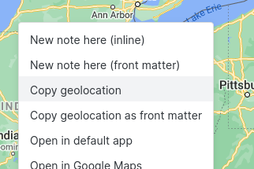

### Paste as Geolocation

Map View monitors the system clipboard, and when it is is detected to contain an encoded geolocation (e.g. a Google Maps "lat, lng" location), a "Paste as geolocation" entry is added to the editor context menu.
For example, if you right-click a location in Google Maps and click the first item in the menu (coordinates in lat,lng format, see [below](#tips)), you can then paste it as a geolocation inside a note.

Alternatively, you can right-click a URL or a supported formatted string that is already present in a note and choose "Convert to geolocation".

By default Map View can parse URLs from two services: the OpenStreetMap "show address" link and a generic "lat, lng" encoding used by many URLs.

### Tips

#### Copying from Google Maps

Google Maps on desktop web offers a very easy shortcut for copying universal `lat, lng` coordinates.

1. Right-click anywhere in the Google map.
2. The first menu item should be the universal coordinates. By clicking it, the coordinates are copied to the clipboard.
3. In any Obsidian note, right click and choose "paste as geolocation", or paste the coordinates into any Map View search box.

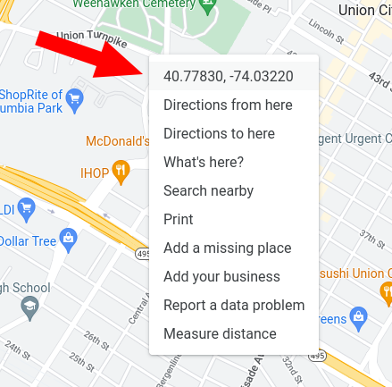

## Queries

Map View supports powerful queries that are roughly similar to Obsidian's query format.

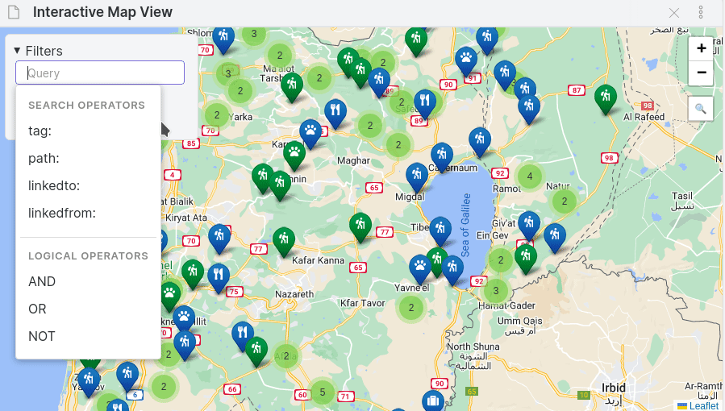

The query string can contain the following _search operators_:

-   `tag:#...` to search for notes or markers tagged with a specific tag.
    -   This works on both whole notes (`#hiking`) and inline tags for specific markers (`tag:hiking`).
-   `name:...` to search for markers that their name contains the given string.
    -   For front-matter geolocations this matches the file name.
    -   For inline geolocations this matches the link name and **ignores** the file name (if you want to always match the file name, use `OR` with `path:`).
-   `path:...` to search by the note path.
    -   This operator will include all the markers in the path that matches the query.
-   `linkedto:...` includes notes that contain a specific link.
    -   This operator will include a note (with all the markers in it) if it has a link name that matches the query.
    -   For example, if you have a note named `Cave Hikes` and you have geolocated notes that **link to it** (e.g. include `[[Cave Hikes]]` as a link), include them by the filter `linkedto:"Cave Hikes"` or a portion of that name.
-   `linkedfrom:...` includes notes that are linked from a specific note, and also the origin note itself.
    -   This operator will include a note (with all the markers in it) if it is linked **from** the note mentioned in the query.
    -   For example, if you have a note named `Trip to Italy` with links to various geolocated notes (e.g. of places you want to visit or a trip log), the query `linkedfrom:"Trip to Italy"` will filter only for those markers.
-   `lines:x-y` includes only inline markers that are defined in the given line range in their note.
    -   For example, `lines:20-30` includes only inline geolocations that are defined in lines 20 to 30 in the file that contains them.

All operators are case insensitive.

You can combine the above with _logical operators_: `AND`, `OR`, `NOT`, and grouping with parenthesis.
**This differs from Obsidian's own query language which uses `-` instead of `NOT` and treats spaces as 'AND'.**

For examples:

-   `linkedfrom:"Trip to Italy" AND tag:#wine` can include places you linked from your trip to Italy, or are within that note itself, and are tagged with `#wine`.
-   `tag:#hike AND tag:#dogs` can include hikes you marked as suitable for dogs.
-   `tag:#hike AND (tag:#dogs OR tag:#amazing) AND NOT path:"bad places"`

There are many creative ways to organize your notes with geolocations that utilize these query abilities.
You may represent location types with tags (e.g. `#hike` or `#restaurant`), or use tags to represent traits of places (`#hike/summer`, `#hike/easy`).
You can use paths for indexes using Zettelkasten back links (e.g. link to "Hikes that I Want" from notes you want to denote as such), then use `linkedto:` to find places that link to it.
And/or you can have notes to plan a trip and link to places from it, then use `linkedfrom:` to focus on your plan.

In all cases you can [save presets](#Presets) that include the filter or sub-filters of it.

## Marker Icons

Map View allows you to customize notes' map marker icons based on a powerful rules system.
These rules can be edited using the plugin's settings pane or edited as JSON for some even more fine-grained control.

Icons are based on [Font Awesome](https://fontawesome.com/), so to add a marker icon you'll need to find its name in the Font Awesome catalog.
Additionally, there are various marker properties (shape, color and more) that are based on [Leaflet.ExtraMarkers](https://github.com/coryasilva/Leaflet.ExtraMarkers#properties).

To change the map marker icons for your notes, go to the Map View settings and scroll to Marker Icon Rules.

A single marker is defined with a _tag pattern_ and _icon details_.
The tag pattern is usually a tag name (e.g. `#dogs`), but it can also be with a wildcard (e.g. `#trips/*`).
Icon details are a few properties: icon name (taken from the Font Awesome catalog), color and shape.

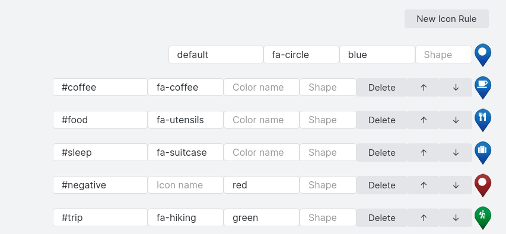

A single marker is defined in the following JSON structure:
`{"prefix": "fas", "icon": "fa-bus", "shape": "circle", "color": "red"}`

To add a marker with a bus icon, click New Icon Rule, search Font Awesome (in the link above) for 'bus', choose [this icon](https://fontawesome.com/v5.15/icons/bus?style=solid), then see that its name is `fa-bus`.
Once you enter `fa-bus` in the icon name, you should immediately see your icon in the preview.
To make this icon apply for notes with the `#travel` tag, type `#travel` in the Tag Name box.

### Tag Rules

To apply an icon to a note with geolocation data, Map View scans the complete list of rules by their order, always starting from `default`.
A rule matches if the tag that it lists is included in the note, and then the rule's fields will overwrite the corresponding fields of the previous matching rules, until all rules were scanned.
This allows you to set rules that change just some properties of the icons, e.g. some rules change the shape according to some tags, some change the color etc.

Here's the example I provide as a probably-not-useful default in the plugin:

```
	{ruleName: "default", preset: true, iconDetails: {"prefix": "fas", "icon": "fa-circle", "markerColor": "blue"}},
	{ruleName: "#trip", preset: false, iconDetails: {"prefix": "fas", "icon": "fa-hiking", "markerColor": "green"}},
	{ruleName: "#trip-water", preset: false, iconDetails: {"prefix": "fas", "markerColor": "blue"}},
	{ruleName: "#dogs", preset: false, iconDetails: {"prefix": "fas", "icon": "fa-paw"}},
```

This means that all notes will have a blue `fa-circle` icon by default.
However, a note with the `#trip` tag will have a green `fa-hiking` icon.
Then, a note that has both the `#trip` and `#trip-water` tags will have a `fa-hiking` marker (when the `#trip` rule is applied), but a **blue** marker, because the `#trip-water` overwrites the `markerColor` that the previous `#trip` rule has set.

Tag rules also support wildcards, e.g. a rule in the form of `"#food*": {...}` will match notes with the tag `#food`, `#food/pizza`, `#food/vegan`, `#food-to-try` etc.

The settings also allow advanced users to manually edit the configuration tree, and there you can use more properties based on the [Leaflet.ExtraMarkers](https://github.com/coryasilva/Leaflet.ExtraMarkers#properties) properties. Manual edits update the GUI in real-time.

## In-Note Location Search & Auto-Complete

Map View adds an Obsidian command named 'Add inline geolocation link', that you can (and encouraged) to map to a keyboard shortcut, e.g. `Ctrl+L` or `Ctrl+Shift+L`.
This command inserts an empty inline location template: `[](geo:)`.

When editing an inline location in this format, whether if you added it manually or using the command, if you start entering a link name, Map View will start offering locations based on a geocoding service.
Selecting one of the suggestions will fill-in the coordinates of the chosen locations and _not_ change your link name (assuming you prefer your own name rather than the formal one offered by the geocoding service).

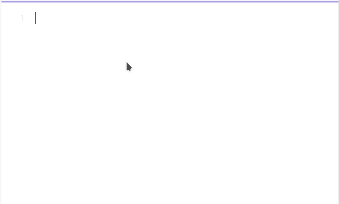

If your note is not yet marked as one including locations (by a `locations:`) tag in the front matter, this is added automatically.

### Changing a Geocoding Provider

By default, Map View is configured to use OpenStreetMap as the search provider.
If you prefer to use the Google Maps search, you can configure this in the plugin settings.

The Google Geocoding API is practically free or very cheap for normal note-taking usage, but you'd need to setup a project and obtain an API key from Google.
See [here](https://developers.google.com/maps/documentation/javascript/get-api-key) for more details.

If you want, you can add to your API key the slightly more expensive [Places API](https://developers.google.com/maps/documentation/places/web-service/cloud-setup), then turn on "Use Google Places for searches" in the Map View settings.
For most reasonable note-taking usage, you will not likely go beyond the Places API free tier.

**Note:** usage of any geocoding provider is at your own risk, and it's your own responsibility to verify you are not violating the service's terms of usage.

## Map Sources

By default, Map View uses the [CartoDB Voyager Map](https://github.com/CartoDB/basemap-styles), which is free for up to 75K requests per month.
However, you can change or add map sources in the configuration with any service that has a tiles API using a standard URL syntax.

There are many services of localized, specialized or just beautifully-rendered maps that you can use, sometimes following a free registration.
See a pretty comprehensive list [here](https://wiki.openstreetmap.org/wiki/Tiles).

Although that's the case with this plugin in general, it's worth noting explicitly that using 3rd party map data properly, and making sure you are not violating any terms of use, is your own responsibility.

Note that Google Maps is not in that list, because although it does provide the same standard form of static tiles in the same URL format, the Google Maps terms of service makes it difficult to legally bundle the maps in an application.

If you have multiple map sources, they can be switched from the View pane.
Additionally, you can set an optional different dark theme URL for each map source.
If a dark theme is detected, or if you specifically change the map source type to Dark (using the drop down in the View pane), you will get the Dark URL if one is configured.

## Presets

If there is a map state you would like to save and easily come back to, you can save it as a preset.
To do so, open the Presets pane in the main plugin's controls, and click 'Save as' to save the current view with a name you can easily go back to.

If you enter an already-existing name, that preset will be overwritten.

The saved preset includes the map state (zoom & pan), the filters used, and if you check the box in the "save as" dialog -- also the chosen map source.
If you do not include the map source as part of the preset, switching to the newly-saved preset will use the currently-selected map source.

Presets _do not_ store the map's theme (light/dark).

The Default preset is special; you can save it using the 'Save as Default' button, and come back to it by clicking the Reset button, by choosing the Default preset from the box, or by opening a fresh Map View that has no previously saved state.

## Open In

Many context menus of Map View display a customizable Open In list, which can open a given location in external sources.
These sources can be Google Maps, OpenStreetMap, specialized mapping tools or pretty much anything you use for viewing locations.

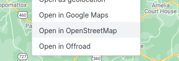

The Open In list is shown:

-   When right-clicking on the map.
-   When right-clicking a marker on the map.
-   When right-clicking a line in a note that has a location.
-   In the context menu of a note that has a front matter location.

This list can be edited through the plugin's settings menu, with a name that will be displayed in the context menus and a URL pattern. The URL pattern has two parameters -- `{x}` and `{y}` -- that will be replaced by the latitude and longitude of the clicked location.

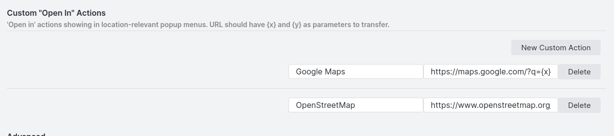

Popular choices may be:

-   Google Maps: `https://maps.google.com/?q={x},{y}`
-   OpenStreetMap: `https://www.openstreetmap.org/#map=16/{x}/{y}` (replace `16` with your preferred zoom level)
-   Waze (online dropped pin): `https://ul.waze.com/ul?ll={x}%2C{y}&navigate=yes&zoom=17` (replace `17` with your preferred zoom level)

And you can figure out many other mapping services just by inspecting the URL.

## URL Parsing Rules

As described above, Map View uses _URL parsing rules_ in several places to provide the ability to parse URLs (or other strings) from external sources and convert them to standard geolocations.

1. When right-clicking a line with a recognized link, a "Convert to Geolocation" entry will be shown in the editor context menu.
2. When a recognized link is detected in the system clipboard, a "Paste as Geolocation" entry will be added in the editor context menu.
3. In the "New geolocation note" dialog and map search, pasting a supported URL will parse the geolocation.

URL parsing rules can be configured in the plugin's configuration pane and requires familiarity with regular expressions.

The syntax expects two captures group and you can configure if they are parsed as `lat, lng` (most common) or `lng, lat`.

And if you think your added regular expressions are solid enough, please add them to the plugin using a PR so others can benefit!

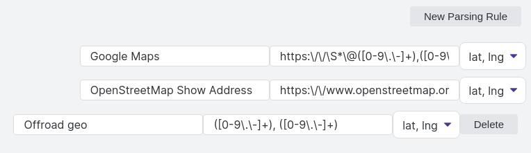

## View URLs

You can save the current map state as a URL, which will open from other apps or from within Obsidian.

Click "Copy Map View URL" from the view's "more options" context menu, or "Copy URL" from the map Presets control.
You can paste the resulting `obsidian://` URL in any local app on your computer or phone, and it will launch Obsidian with Map View in the same view you saved.

Alternatively, you can paste this link inside a note and make it clickable by making it a Markdown link: `[Link name](url...)`.
This is really useful for going to a specific view (with its query, map source, zoom, pan etc) that is related to a note, e.g. a trip plan.

## Follow Active Note

Map View has a mode on which the map refocuses according to the currently active file, so if you have Map View open in its own pane, it can follow whatever file you are currently focused on.

This is closely related to the setting of "map follows search results", and probably works most intuitively when it is on.

The specific behavior of how to "follow" the active note can be configured via the 'query format for "follow active note"' setting in the configuration.
By default, Map View uses the [query](#queries) `path:"$PATH$"`, which means that when you switch to a note, the view automatically updates the query to show only the markers within the path of this note. You can edit this setting to achieve more fine-grained behaviors, for example:

-   Use `linkedfrom:"$PATH$"` for a more elaborate inclusion of markers from both the file you're on and files it links to.
-   Use `linkedfrom:"$PATH$" OR linkedto:"$PATH$"` to include markers that the active note links to and also markers that _link to this file_.

## Relation to Other Obsidian Plugins

When thinking about Obsidian and maps, the first plugin that comes to mind is [Obsidian Leaflet](https://github.com/valentine195/obsidian-leaflet-plugin).
That plugin is great at rendering maps based on data within a note, with great customization options.
It can also scan for data inside a directory which gives even more power.
In contrast, Obsidian Map View is focused on showing and interacting with your notes geographically.

Another relevant plugin is [Obsidian Map](https://github.com/Darakah/obsidian-map) which seems to focus on powerful tools for map drawing.

## Changelog

### 2.2.0

**New:**

- Selecting a range of lines in the editor that have multiple geolocations will show a new "focus X geolocations in Map View" context menu item.
- A new `name` query filter (to filter for a geolocation name) and a `lines` filter (to filter for a line range within a file).
- Small UI improvements, e.g. icons in pop-ups.
- "Focus Note in Map View" is now shown also for notes that have no geolocations, since the "follow active note" query format may look into links.

**Fixes:**

- **Various fixes and tweaks required for Obsidian 0.16.x.**
  - As part of this, "paste as geolocation" is now always shown in the editor context menu, regardless of whether a string that can be parsed was found in the clipboard. This is due to a change of how menus in Obsidian work, which doesn't allow to inspect the clipboard while populating the menu.
- Fixed Google Places search not working on Mobile due to `querystring` not being present for some reason.
- Fixed pop-ups not always clickable on mobile.
- Fixed a problem in parsing link names on lines that contain other links.

### 2.1.1

Fix for OpenStreetMap geolocation search stopped working for some users.

### 2.1.0

**BREAKING:** this release requires Obsidian 0.15.3 or newer.

**New:**

-   The results of a search, or a focused geolocation, is now highlighted by a blue glow on the map.
    -   The glow can be customized via CSS.
-   Made the graph controls more compact when minimized and properly positioned in more cases.
-   "Follow active note" now works using a customizable query, see [here](#follow-active-note) for details.
-   Clearing "follow active note" now resets the query.
-   Search results are now shown sorted by distance from the center of the map.
-   Shift+Enter on an existing marker in the search result will go to that marker without zooming. This goes hand-in-hand with the highlighting introduced above, so you can easily highlight various markers without the map view changing.
-   When using Google Places as the search provider, geosearch results now give priority to the displayed area.
-   Adapted the various menus to utilize the Obsidian 0.15.x sections.
-   Upgrade the Font Awesome library to 6.1, making more icons available.
-   On mobile, some map interactions are custom-tailored for tapping (tapping a marker shows its name, long-tapping opens the menu).

**Fixes:**

-   Fixed misbehavior of the controls in the case of multiple Map View instances.
-   Fixed Map View interfering with the Graph View controls in some themes.
-   Fixed inline tags not recognized when followed by a comma.
-   Various fixes to the internal state update mechanism, hopefully allowing smoother zoom/pan operations with no unexpected jumps.
    -   As part of this, zoom/pan animations are back on state transitions.
-   Fixes for "follow active note" on Obsidian 0.15.x.
-   Fixed a duplication bug if a file contains multiple markers in the same geolocation (https://github.com/esm7/obsidian-map-view/issues/85).

### 2.0.5

-   Improved the logic of saving "back/forward" history in a few cases, and optimized the state update logic to make transitions faster.
-   More fixes to "follow active note" when "map follows search results" is set (https://github.com/esm7/obsidian-map-view/issues/92).
-   Fixed "add geolocation (frontmatter)" to notes that contain `---` as a content separator (https://github.com/esm7/obsidian-map-view/issues/98). Thanks @MattWilcox!
-   Fixed paths with backslashes not working in "new note path" (https://github.com/esm7/obsidian-map-view/issues/97).
-   Fix to new note map action not working on Android (https://github.com/esm7/obsidian-map-view/issues/96).
-   The default zoom for "show on map" action, as set in the settings, is now also used as a max zoom in "map follows search results".
-   In-note tag suggestions no longer include the pound sign (which should not be there for inline tags).

### 2.0.4

-   Fixed an issue with cluster expansion not working.
-   Improved "copy URL" handling between different devices.
-   Added a clear button to the new query box.
-   Fixed touch move & zoom that stopped working due to an unintended upgrade to Leaflet 1.8.0.
-   Fixed inconsistent moves and jumps during fast series of events.

### 2.0.3

-   Fixed searched stopped working in some cases which are not the new Google Places (https://github.com/esm7/obsidian-map-view/issues/93).
-   Fixes to "follow active note" (https://github.com/esm7/obsidian-map-view/issues/92).

### 2.0.0

This is a massive version with a huge number of updates, pushing Map View to the next level of functionality!

-   Instead of the previous simplistic tag filtering, Map View now has a powerful [Queries](#queries) mechanism with multiple search and logical operators.
    -   Queries are marker-based and not file-based. This will be a breaking change for some users.
-   Under the View control, turn on "follow active note" for Map View to focus on any note that is opened or changed (https://github.com/esm7/obsidian-map-view/issues/71).
-   Showing the note name is now optional (https://github.com/esm7/obsidian-map-view/issues/75). I wish this could be in the same popup as the preview, but currently I don't see how to do this.
-   Fixed issues with front matter tag support (https://github.com/esm7/obsidian-map-view/issues/72) (thanks @gentlegiantJGC!)
-   Added a configuration for the max zoom of a tile layer (thanks @gentlegiantJGC!).
    -   This also includes a new "zoom beyond max" setting, which will not limit you to the highest zoom level of a tile source.
-   The map search tool now uses the same search window as "New geolocation note", which beyond the configured geocoding service, also does URL parsing.
    -   It also includes existing markers, so you can quickly jump to an existing name on the map.
    -   Except the bonus of making the UI more uniform, this is very important for usability, especially on mobile. e.g. you can use it to get your location from another app and use it to create notes or explore around.
    -   A "search active map view" command was added (available when a map view is focused) so a keyboard shortcut can be assigned to the map search.
-   Auto-completion for inline tags. If you type `tag:` in a line that includes a valid geolocation, you will get suggestions for tag names.
-   In the context menu of a map view, or in the Presets controls section, you can copy the active view as a link.
    -   Clicking this link from another app should launch Obsidian and open Map View with the exact same view (including the query, zoom, pan and map source).
    -   To use this in Obsidian notes paste the URL inside a link, e.g. `[Link name](obsidian://...)`
-   All the geolocation searches now support the Google Places API, and will prefer results from Places API over the simpler Google Geolocation API.
    -   This requires your Google API key to include credentials for Google Places, see the documentation above.
-   Several UI improvements:
    -   The map control panel is now prettier and smaller when unused.
    -   The note name and cluster popups now follow the Obsidian theme.

### 1.5.0

-   Map View now saves its state to the Obsidian back/forward mechanism (unless configured not to).
-   Fixed an issue with markers temporarily duplicating (until the map is refreshed) when their note is renamed.

### 1.4.0

-   Replaced OpenStreetMap with CartoDB as the new default map source (https://github.com/esm7/obsidian-map-view/issues/59).
-   Map View now displays a more useful error when tiles fail to load.
-   Removed the "Google Maps" default URL parsing rule because apparently it was incorrect (https://github.com/esm7/obsidian-map-view/issues/57). It is now replaced by a more generic "lat,lng" rule that can also be used with Google Maps, _not_ by parsing the URL but by right-clicking the map in Google Maps and choosing the first menu item that copies the coordinates.
-   Hovering on a map marker now opens the Obsidian note preview, scrolled to the correct line (https://github.com/esm7/obsidian-map-view/issues/60). This is configurable in the settings and comes _in addition_ to the existing note pop-up (without a snippet), because the preview does not include the note name.
    -   **Important note:** this replaces the "snippet" functionality of previous versions.
-   Marker clusters now show a preview of their own; they show a popup with the first 4 icons in the cluster.

### 1.3.0

-   Introduction of **Presets** as a way to save the state of the view including the map state, filters and optionally the chosen map source.
    -   As part of this, the 'default view' functionality was converted to a built-in 'Default' preset and the UI was revamped accordingly.
-   As part of the above, the internal structure of the plugin had to be reorganized and many features needed to be rewired. **I put major effort to test the entire functionality of the plugin, but pretty much anything could break and I may have missed some bugs.** Please open issues if something had stopped working.
-   When using `{{query}}` in file name templates, the file name is sanitized so the creation won't fail on illegal strings.

### 1.2.1

-   The "new geolocation note" dialog can now also be used to add a location to an existing note, both via a new Obsidian command and a file menu action (https://github.com/esm7/obsidian-map-view/issues/46).
-   Added a `{{query}}` file name template option to auto-add the search query for new location notes (https://github.com/esm7/obsidian-map-view/issues/45).

### 1.2.0

-   Added a "new geolocation note" Obsidian command with an interactive search and URL parser.
-   Fixed a bug of highlighting more than the intended line after clicking a map marker and opening a note.
-   Fixed a bug of inline tags not recognized if immediately followed by a dot (which is a common pattern).
-   Fixed an exception that could prevent settings to be applied after closing the settings dialog.

### 1.1.0

-   The plugin now supports a configurable list of map sources, switchable from the View pane on the map, including optional separate URLs for light & dark themes.
-   Support dark mode using a CSS hue revert, as [recommended for Leaflet](https://gist.github.com/BrendonKoz/b1df234fe3ee388b402cd8e98f7eedbd) and as done by obsidian-leaflet.
-   [Support multiple inline locations per line](https://github.com/esm7/obsidian-map-view/issues/35).
-   [Support multiple tags per inline location](https://github.com/esm7/obsidian-map-view/issues/32).
-   Fixed an [issue](https://github.com/esm7/obsidian-map-view/issues/30) of inline tags not properly including the dash (`-`) character.
-   Popups now have a close button (to make them more mobile-friendly).

### 1.0.0

-   UI revisions and cleanups to make it easier for new users. **Some changes break existing notions.**
    -   Map View now treats "inline locations" as the default. It is first in the menus, and front matter actions are listed as "front matter".
    -   "Copy as coordinates" was removed, believing it's not really useful anymore. Please drop me a note if you find it important.
    -   Several other tweaks to make the plugin easier to use.
-   At last, a settings UI for editing marker icons! Check it out under the plugin settings.
    -   In order to do this, the rule format in the plugin's data file had to be changed. The plugin will auto-convert your existing rules to the new format when first launched. After this conversion, _do not_ manually enter rules under the old key!
    -   You may still edit rules manually, through the plugin's "edit marker icons as JSON" box or directly in the data file, but **only use the new key** `markerIconRules`.
-   Added an inline geolocation search, which can get results from either OSM or Google (with an API key), and a command to insert a geolocation.
-   With relation to the above, the search tool in the map can now use the selected geocoding service too, meaning you can use Google Maps to search for locations if you have an API key.
-   New "paste as geolocation" and "convert to geolocation" right-click editor menu items, that can automatically convert URLs in the clipboard or URLs in the note to a geolocation link.
    -   The rules that convert URLs to geolocations are configurable in the settings.
