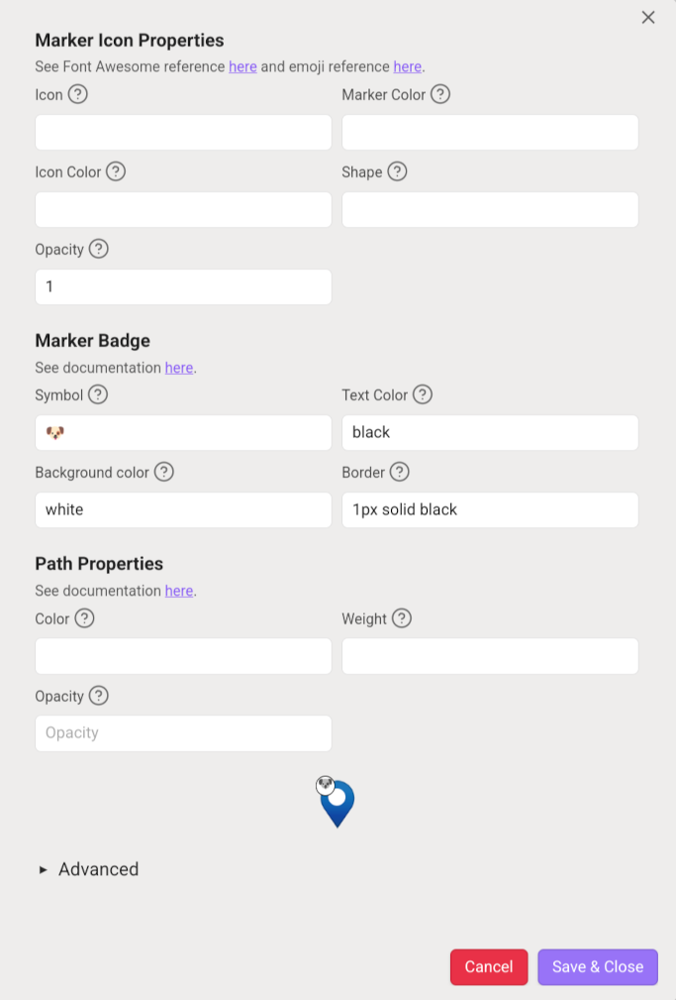

# Obsidian.md Map View

[](https://www.buymeacoffee.com/esm7)

## Intro

This plugin introduces an **interactive map view** for [Obsidian.md](https://obsidian.md/).
It searches your notes for encoded geolocations and paths in various formats (see below), places them on a map and offers many tools to interact with them.

It effectively turns your Obsidian vault into a **personal GIS system** that adds a geographical layer to your notes, journals, trip planning and pretty much anything you use Obsidian for.

You can...

- Follow your current location on mobile.
- Add locations using a built-in search (optionally utilizing Google Places).
- Save geolocations from a variety of sources.
- View paths in GeoJSON, GPX, KML and TCX formats.
- Draw locations and shapes on the map.
- Instantly calculate routes between points and get driving/cycling/walking estimations.
- Use Map View together with Obsidian Bases, as a fully customizable view of a Base.

Plus...

- Customize marker icons, badges, shapes, colors, path properties and more using sophisticated display rules.
- Use a powerful query system.
- Embed maps in notes with great level of control.
- Quickly switch between map layers and save presets.
- Save maps for offline usage.

And much, **much** more -- this is quite a powerful tool.


I wrote this plugin because I wanted my ever-growing Zettelkasten to be able to answer questions like...

- When I get recommendations about cool places to visit, how do I save them in a way that I can recall later?
- When I'm visiting somewhere, what interesting places do I know in the area?
- When I'm conducting research for planning a trip, how do I lay out on a map options for places to eat, hike or sleep, combine them with prior knowledge, and save them for future reference?

Map View can integrate with your note-taking flow in order to answer all of these questions and much more.

Just like the Obsidian graph view lets you visualize associative relations between some of your notes, the map view lets you visualize geographic ones.

## Support the Development

If you want to support the development of this plugin, please consider to [buy me a coffee](https://www.buymeacoffee.com/esm7).

## Quick How To

Map View is a powerful tool with many ways to use it.
If you wanna learn it thoroughly, you may wanna start from [understanding how it works](#understanding-map-view-parsing-location-data).
But if you wanna dive right in and give it a try, or get a quick glimpse of what it can do, continue reading.

### Log a Geolocation

Here are a few examples for logging a favorite location you want to see in a map.

**Option 1: from a Note**

- Starting from a note, e.g. your daily note or a note referring to a trip plan, launch the Obsidian Command Palette and choose "Map View: add inline geolocation link".
- A link in the format of `[](geo:)` will be added where your cursor is.
- Start typing a location name inside the bracket, and some geolocation results will pop up. Choose one and your _inline location_ is complete.


(Note: the default geosearch provider requires you fill-in your email address, see [here](#location-search--auto-complete) for more details.)

**Option 2: from the Map**

- Open Map View (e.g. from the Obsidian ribbon icon).
- Search or locate a location, e.g. using the search tool.
- Right-click the map and choose "new note here (front matter)" to create a note logging the selection point.

**Option 3: from the Map using Edit Mode**

- Open Map View.
- Switch to Edit Mode using the pencil icon on the right.
- Click the red "Choose Note" button to select which note you want to add items to.
- Place markers or other shapes on the map using the tools that appeared below the pencil icon.
- When in Edit Mode you can move or edit other markers and paths as well.

**There are many other ways to log geolocations in Map View**, see [here](#adding-a-location-to-a-note) for more details.

### Create a Trip Plan Map

There are many flows you can use to create custom maps, interact with them and use them for research and planning -- here's one that I typically use for trip planning.

**Step 1: log some locations.**

For most trips, I like to use a single note with sections, for example:

```
## To Visit

- [Place 1](geo:...) tag:activity
  - Some information about this place
- [Place 2](geo:...) tag:activity
  - Information about this place

## To Eat

- [Restaurant1](geo:...) tag:food
  - Opening hours, other data...
- [Restaurant2](geo:...) tag:food
  - Opening hours, other data...
```

I add the places using one of the methods above (by searching with "add inline geolocation link") or by one of the many other methods described below.
Notice the [inline tags](#understanding-map-view-parsing-location-data), these can be used for custom filters and/or creating different icons for different types of places.

**Step 2: map them!**

In the case of a single note, just click the note's menu (3 dots) and choose "focus (note name) in Map View".
You should immediately see a map of all your locations, and if you spend some moments to configure [marker icons](#marker-icons), you can easily get different shapes and colors for your various tags.

**Step 3: save this map**

You have a few options here.

One thing you can do is to open the Presets section on the map and save the current view, then open it from Map View anytime.

Another option is to save an embed: in Presets click 'Copy block' (or "Copy Map View code block" from the note menu), then paste the resulting code into a note.


**There are many more options of how to build a trip plan, present it and use it.**
[This](https://www.reddit.com/r/ObsidianMD/comments/xi42pt/planning_a_vacation_with_map_view/) post gives a more detailed example, and diving into the details of how Map View works will help you find your own optimal flow.

### Build Your Personal Geographic Information System (GIS)

The most powerful way to use Map View is to build a complete personal GIS (Geographic Information System) from your notes vault.
I personally do this as follows.

**1. Collection**

This part isn't specific to Map View, but the main idea is that I [collect](https://en.wikipedia.org/wiki/Getting_Things_Done) pieces of information from various sources, that often contain some geographic information.

For example, I can save a Facebook post that recommends a new restaurant, clip a cool hike from a hiking group, or draft a quick note when a friend tells me about a place that I want to remember.

I later turn these into notes, but of course if that's not how you do things, you can skip to Processing.

**2. Processing**

When I turn my clipped pieces of information into notes, I add geolocations as follows.

- For pieces of information that are _mainly geographical_, e.g. a restaurant recommendation, a hike or somewhere I may want to visit, I create a Zettelkasten note, then use the Map View "add geolocation (front matter) to current note" to tag the relevant geolocation.
    - If the location isn't easy to find using a text search, I usually open a more specific mapping tool like a hiking map, locate the place that I want, copy it in lat,lng format and paste it into the same search box above.
    - Alternatively, I sometimes prefer to locate it on the map, then right-click and "copy geolocation as front matter" (or create the note from the map in the first place).
    - I then tag the complete note with some useful metadata. Examples include: `#hike`, `#season/spring`, `#dogs`, `#camping`, `#food`, `#food/pizza`, `#activity`, `#activity/kids`, `#not` (for negative recommendations).
- For bulks of geographical information, like a list of recommended coffee shops in a city, I create a note and add all geolocations via inline geolocation links. I have the "add inline geolocation link" command mapped to `Alt+L` so I can easily start a location search while typing a note.

**3. Querying**

There are countless occasions that I query my Personal GIS.

- When planning a trip I often look at the area that I'm visiting, sometimes saving it as a preset without any filter applied, and get a general understanding of what I know about the area.
- I often query the system for a specific set of needs. For example, I obsessively collect information about dog-friendly activities around where I live, so when I want to go camping I query for `#dogs AND #sleep` (to search for dog-friendly camp sites) and to choose dining options I query for `#dogs AND #food`. See [here](#queries) to learn more about how queries work and what you can do with them.
- When visiting an unknown area I frequently launch Map View from Obsidian Mobile to account for change in plans or finding what to do without planning in advance.

See also [this](https://www.reddit.com/r/ObsidianMD/comments/xi42pt/planning_a_vacation_with_map_view/) Reddit post about planning a vacation with Map View.

## Understanding Map View: Parsing Location Data

Map View provides [several methods to log locations in notes](#adding-a-location-to-a-note) and can manage the technicalities for you.
You can skip to that section if you want to just get started, or continue reading the more technical explanation below.

**To clarify, the best way to use Map View is to never enter a geolocation manually.**
You will, however, need to understand the difference between the front matter and the inline formats, and decide when to use which.

So, the plugin works by scanning your notes and parsing two types of location data.

First is a location tag in a note's [front matter](https://help.obsidian.md/Advanced+topics/YAML+front+matter):

<!-- prettier-ignore-start -->
```yaml
---
location: 40.6892494,-74.0466891
---
```
<!-- prettier-ignore-end -->

This is useful for notes that represent a single specific location.

There is an alternative syntax used by Map View previously: `location: [40.6892494, -74.0466891]`. While this format is compatible with [obsidian-leaflet](https://github.com/valentine195/obsidian-leaflet-plugin), it doesn't play very well with Obsidian's property editor. Both format are supported by the new one is encouraged for Obsidian version 1.4 and above.

Another way that the plugin parses location data is through **inline location URLs** in the format of `[link-name](geo:40.68,-74.04)`, which allow multiple markers in the same note.
To prevent the need to scan the full content of all your notes, it requires an empty `locations:` tag in the note front matter ('locations' and not 'location').
(In most methods of entering geolocations Map View will do this automatically.)
Example:

```
---
locations:
---

# Trip Plan

Point 1: [Hudson River](geo:42.277578,-76.1598107)
... more note content ...

Point 2: [New Haven](geo:41.2982672,-72.9991356)
```

Notes with multiple markers will contain multiple markers on the map with the same note name, and clicking on the marker will jump to the correct location within the note.

Inline locations also support **inline tags** in the format of `tag:dogs` (without the `#` sign). For example:

```
Point 1: [Hudson River](geo:42.277578,-76.1598107) tag:dogs
```

This will add the tag `#dogs` specifically to that point, regardless of the note's own tags.
This is useful for notes that contain tags of different types (e.g. a trip log with various types of locations).
Note that the `tag:` format should be used **without** the `#` sign, because this sets the tag for the whole note.
Map View will internally add `#` for the purpose of queries and marker icons, as explained below.

Multiple inline tags can be separated with a whitespace: `[](geo:42.2,-76.15) tag:dogs tag:trip`.

Multiple inline locations can be added in the same line, and the tags that follow them will be associated to the location on the left, but the right-click editor context menu will not know to choose the location that was selected.

Instead of using a `locations:` YAML tag, you can use a custom note tag. See "tag name to denote inline geolocations" in the settings. (This also works with wildcards.)
It will not be automatically added when you need it like the `locations:` YAML tag, however if you add an inline geolocation to an existing note where your custom tag is found, Map View will not add a `locations:` YAML tag.
**IMPORTANT NOTE:** for the time being, using this feature (i.e. having a non-empty "tag name to denote inline geolocations") slows down Map View by an order of magnitude. I'm looking into speeding it up in future releases.

For interoperability with Obsidian's property editor and possibly other plugins, Map View will also parse the syntax of:

```yaml
location:
    - '39.100105'
    - '-94.5781416'
```

And also:

```yaml
location:
    - 39.100105,-94.5781416
```

## Adding a Location to a Note

Map View offers many ways to add geolocations to notes.

### Anywhere in Obsidian

Map View adds an Obsidian command named "New geolocation note", which you can map to a hotkey and use anywhere in Obsidian.

This opens a dialog on which you can search (address or location based on your [configured geocoding provider](#changing-a-geocoding-provider)) or paste a URL using the built-in or custom [URL parsing rules](#url-parsing-rules).

### In an Existing Note

There are multiple ways to add a geolocation to an existing note.

1. Create an inline geolocation link in the format of `[](geo:)`, and if you start typing inside the link name (the brackets), Map View will initiate a location search. If you confirm one of the options, it will fill-in the location's coordinates. See more on this in the ["In-Note Location Search"](#location-search--auto-complete) section below.

To make this more streamlined, Map View adds to Obsidian a command named 'Add inline geolocation link' which you can map to a keyboard shortcut.

2. Add a front matter geolocation by using the Obsidian command 'Add geolocation (front matter) to current note'. This opens the same dialog as "new geolocation note" which allows you to search for a location name or paste a [URL parsing rules](#url-parsing-rules).

3. If you have a geolocation in some other mapping service that you wish to log, e.g. from Google Maps, you can copy the URL or "lat,lng" geolocation from that service, right-click in your note and select "Paste as Geolocation". The supported services are configurable, see [below](#url-parsing-rules) for more details.

### From the Map

The map offers several tools to create notes or add markers to existing notes.

1. Use "new note here" when right-clicking the map. This will create a new note (based on the template you can change in the settings) with the location that you clicked. You can create either an empty note with a front matter (single geolocation) or an empty note with an inline geolocation.


The map can be searched using the tool on the upper-right side, so you can quickly jump to the place you want to mark.
[URL parsing rules](#url-parsing-rules) also work here, so you can [copy a geolocation from Google Maps](#tip-copying-from-google-maps) (or any other service) and jump to it.


2. Using Edit Mode: click the pencil icon on the right, choose a note to edit by clicking the red button on the left, then add markers (or other shapes) using the marker tool below the pencil icon. Alternatively, when in Edit Mode, you can right-click anywhere on the map and select "Add to Edit Mode note".

3. If you prefer to enter geolocations as text, use one of the "copy geolocation" options when you right-click the map and paste them in a note.


### Paste as Geolocation

Map View monitors the system clipboard, and when it is is detected to contain an encoded geolocation (e.g. a Google Maps "lat, lng" location), a "Paste as geolocation" entry is added to the editor context menu.
For example, if you right-click a location in Google Maps and click the first item in the menu (coordinates in lat,lng format, see [below](#tip-copying-from-google-maps)), you can then paste it as a geolocation inside a note.

Alternatively, you can right-click a URL or a supported formatted string that is already present in a note and choose "Convert to geolocation".

By default Map View can parse URLs from two services: the OpenStreetMap "show address" link and a generic "lat, lng" encoding used by many URLs.

### Tip: Copying from Google Maps

Google Maps on desktop web offers a very easy shortcut for copying universal `lat, lng` coordinates.

1. Right-click anywhere in the Google map.
2. The first menu item should be the universal coordinates. By clicking it, the coordinates are copied to the clipboard.
3. In any Obsidian note, right click and choose "paste as geolocation", or paste the coordinates into any Map View search box.


## Embedding Maps in Notes

Map View supports the Obsidian code block format for embedding maps in notes.
There are several ways to do this:

1. **Embedding an existing map.** To embed an existing map from Map View, including its query and any other settings, click 'Copy Block' from the map's Presets dropdown and paste the block into a note.


1. **Embedding directly from a note.** From the editor, right-click and choose "embed a Map View" from the context menu, then enter a search term that will be used for the center of the map. Alternatively, there's an Obsidian command named "Map View: add an embedded map" that you can assign to a keyboard shortcut.


Once a map is embedded in a note, it represents a live view that updates according to your notes.
Geolocations that are added or modified in the viewed area, and match the query that is saved in the embed, will be updated live.

You can make light adjustments to the view from within the embed (change its zoom, pan or height), and if you want these to be saved, click the 'Save' button that will appear.

To make bigger adjustments, such as updating the query or changing the view completely, use the Open button, make your changes, then click 'Update from open Map View' in the embed's View menu.
Note that if you have multiple full instances of Map View open, 'Update from open Map View' may not do what you intended, and you may need to close the unwanted views first.

Embeds also work really nicely in Canvas including live updates.


### Advanced Additional Options

- The query field in an embedded map supports a template parameter `$filename$`. If, for example, you wish to embed a map in a note template, you can edit the `query` field of the code block to be `"query":"linkedfrom:\"$filename$\" OR linkedto:\"$filename$\""`, and the map will always reference the host note.

**Known annoyance:** the `$filename$` replacement is currently performed when processing the code block and sent to Map View as a final result. Therefore, if you edit the embed interactively (e.g. by zoom or pan and clicking Save), the `query` field will be overwritten with the actual file name rather than the template.

- The JSON in the embedded map code block supports an `autoFit` boolean flag. When set to `true` (i.e. add `"autoFit":true` to the code block's JSON), the map will load with the given pan and zoom, but will then perform an auto-fit and override further zoom and pan changes. This has the annoyance of animating zoom/pan if the saved state is different than the auto-fitted one (click Save to freeze a new state in such a case). I eventually want to bake this nicely to the UI with some more reasonable behaviors.

- The embedded map code block also supports an optional `customViewSettings` object, which allows for some adjustments to the map's UI. Properties and their defaults are defined in [`embeddedMap.ts`](https://github.com/esm7/obsidian-map-view/blob/master/src/embeddedMap.ts#L31-L47).

## Paths


Map View supports paths in a variety of formats and usage patterns.
Somewhat similarly to markers, there is a distinction between **stand-alone path files** and **inline paths**.

### Stand-Alone Path Files

Stand-alone path files can be any GPX, KML, TCX or GeoJSON files in your vault.
Somewhat similarly to front matter geolocations, Map View collects everything from your vault and displays paths based on [display rules](#marker--path-display-rules) and [filters](#queries).

Without any filters present, with the default settings, any supported path file in your vault will be displayed using the default path display style.

Stand-alone paths can be included or excluded using many of the query operators like `path`, `name` and `linkedfrom`.

There is no notion of tags for stand-alone paths, so in order to apply display rules to them, you have a couple of other options:

- Include a relevant string in the file name and use the `path` or `name` operators.
- Use the `linkedfrom` operator, e.g. have a note "my runs" that links to all your GPX tracks, and use `linkedfrom:"my runs"` to apply display rules to these paths.

Here are a few options for how to add stand-alone paths to your vault:

1. Use Obsidian's "insert attachment" command to insert a path file (e.g. a GPX) as an embed to a note you are working on. Although a path does not need to be referenced from a note to be shown in the map, it is often useful to put paths in contexts, and this command copies the file into the vault and adds it to a note in one step.
2. From Map View, enter Edit Mode by clicking the pencil icon on the right side, click the file icon, then click "import a path as vault attachment". The selected file will be added to the vault under your default attachments folder.
3. Just copy the file into your vault using your system's file explorer. It should be automatically recognized and appear.

### Inline Paths

Map View supports GeoJSON paths stored in notes using a code block of type `geojson`.
By default, a fenced code block with type `geojson` will be rendered by Map View inside the note.

Unlike stand-alone path files, inline paths support tags by adding a line of the form `tag:a tag:b` right below the code block.
Also, another advantage of inline paths is that they can be modified using the Edit Mode tools.

For example, the following code block defines a line with the tag `#hike`:

````
```geojson
{"type":"Feature","properties":{},"geometry":{"type":"LineString","coordinates":[[13.754839,42.030225],[14.033704,42.045011]]}}
```
tag:hike
````

The easiest way to add an inline path to a note is using Map View's Edit Mode.
To enter Edit Mode, click the pencil button on the right, or the "Edit" drop-down on the left. Then choose a note to edit.
From there you can either:

1. Draw a path on the map using the Edit Mode tools on the right. When done, the path will be added to the selected note.
2. From the edit mode tools on the right, click the file icon, then click "import a path and add to Edit Mode note". The path will be converted to GeoJSON and added as an inline path to your selected note.

(Note: You will not see the path appear when done if it is excluded from the current filter.)

### Styling Paths

Similarly to markers, the way paths are displayed on the map can be heavily customized using powerful [display rules](#marker--path-display-rules).
There are two main differences between markers and paths in this regard:

1. Paths have different properties available for styling.
2. Stand-alone path files do not support tags, so in order to reference them with display rules, you will need to use names or `linkedto` queries.

See [here](#path-properties) for more details.

## Queries

Map View supports powerful queries that are roughly similar to Obsidian's query format.


The query string can contain the following _search operators_:

- `tag:#...` to search for notes or markers tagged with a specific tag.
    - This works on both whole notes (`#hiking`) and inline tags for specific markers (`tag:hiking`).
    - You can also use wildcards like in [tag rules](#tag-rules), e.g. `tag:#sleep*` will match `#sleep` but also `#sleep/camping`.
- `name:...` to search for markers that their name contains the given string.
    - For front-matter geolocations this matches the file name.
    - For inline geolocations this matches the link name and **ignores** the file name (if you want to always match the file name, use `OR` with `path:`).
- `path:...` to search by the note path.
    - This operator will include all the markers in the path that matches the query.
- `linkedto:...` includes notes that contain a specific link.
    - This operator will include a note (with all the markers in it) if it has a link name that matches the query.
    - For example, if you have a note named `Cave Hikes` and you have geolocated notes that **link to it** (e.g. include `[[Cave Hikes]]` as a link), include them by the filter `linkedto:"Cave Hikes"`.
    - Anything that resolves into a legal Obsidian link will work, e.g. both a note name ('Cave Hikes') or a path will do, but a partial name will not.
- `linkedfrom:...` includes notes that are linked from a specific note, and also the origin note itself.
    - This operator will include a note (with all the markers in it) if it is linked **from** the note mentioned in the query.
    - For example, if you have a note named `Trip to Italy` with links to various geolocated notes (e.g. of places you want to visit or a trip log), the query `linkedfrom:"Trip to Italy"` will filter only for those markers.
    - Anything that resolves into a legal Obsidian link will work, e.g. both a note name ('Cave Hikes') or a path will do, but a partial name will not.
    - Obsidian heading and block links are supported: if a link in the 'from' file includes a heading or a block link, it will match only front-matter markers or inline markers _within that heading or block_.
    - The Obsidian Plugin ["Copy Block Link"](https://github.com/mgmeyers/obsidian-copy-block-link) makes this extra useful.
- `["property":"value"]` includes notes with the property name `property` set to `value`.
- `lines:x-y` includes only inline markers that are defined in the given line range in their note.
    - For example, `lines:20-30` includes only inline geolocations that are defined in lines 20 to 30 in the file that contains them.

All operators are case insensitive.

You can combine the above with _logical operators_: `AND`, `OR`, `NOT`, and grouping with parenthesis.
**This differs from Obsidian's own query language which uses `-` instead of `NOT` and treats spaces as 'AND'.**

For examples:

- `linkedfrom:"Trip to Italy" AND tag:#wine` can include places you linked from your trip to Italy, or are within that note itself, and are tagged with `#wine`.
- `tag:#hike AND tag:#dogs` can include hikes you marked as suitable for dogs.
- `tag:#hike AND (tag:#dogs OR tag:#amazing) AND NOT path:"bad places"`

There are many creative ways to organize your notes with geolocations that utilize these query abilities.
You may represent location types with tags (e.g. `#hike` or `#restaurant`), or use tags to represent traits of places (`#hike/summer`, `#hike/easy`).
You can use paths for indexes using Zettelkasten back links (e.g. link to "Hikes that I Want" from notes you want to denote as such), then use `linkedto:` to find places that link to it.
And/or you can have notes to plan a trip and link to places from it, then use `linkedfrom:` to focus on your plan.

In all cases you can [save presets](#Presets) that include the filter or sub-filters of it.

## Marker & Path Display Rules


Map View includes a powerful mechanism that allows you to customize map markers and path display properties based on a flexible rules system.
These are called Display Rules.

Display rules are made of a **query**, which is the same as discussed [here](#queries), and various properties to apply to a marker or a path that match the query.
When Map View tries to decide how to display a marker or a path, it starts from the Default display rule, which has a certain set of properties (e.g. a blue marker with a circle). It then tests the rest of the display rules by order, and for each rule with a matching query, overwrites whatever properties that rule sets.

For example, the default rule for markers may be a blue marker color with an `fa-circle` icon. If the marker also matches a rule below the default one (e.g. a rule like `tag:#food`), and that rule sets just the icon to `fa-utensils`, the resulting marker will be blue (because the 2nd rule did not override the color) with an `fa-utensils` icon.

(Note to Map View users prior to version 6.0.0: this is the same way Marker Icons worked before, except that rules use _queries_ rather than tags, allowing more flexibility.)

To edit display rules, open the plugin settings, and click the button under the "Marker & Path Display Rules" section.
You will see the list of the currently-active rules. You can add new rules, change the order of rules (except the default which must be first), and edit existing rules.
When editing a rule, you will be able to set various properties that the rule can apply. All these properties are optional, and will overwrite the default (or prior matching rules) for every marker or path that will match its query.



### Marker Icon Properties

Icons are based on either [emojis](https://emojipedia.org) or [Font Awesome](https://fontawesome.com/), so to add a marker icon you'll need to copy the emoji or find the name in the Font Awesome catalog.
Additionally, there are various marker properties (shape, color and more) that are based on [Leaflet.ExtraMarkers](https://github.com/coryasilva/Leaflet.ExtraMarkers#properties).
An additional shape of `simple-circle`, that draws a circle at the given color without a pin shape, is supported on top of these.

For example, if you want markers with the `#travel` tag to have a bus icon, add a display rule with the query `tag:#travel`. Then click Edit, search the Font Awesome catalog for the appropriate icon (in this case `fa-bus`), and enter that in the 'icon' box.

Alternatively, just paste an emoji of a bus (e.g. from [Emojipedia](https://emojipedia.org)) into the icon name box.

### Marker Badge

You can add more information to markers using **badges**, which are little circles that are added in the corners of markers based on criteria that you choose.
Up to 4 badges are supported per marker.
**The natural use case for badges is when you can add additional information on top of a marker.** For example, if you have an icon for `#food` markers, you can add badges that would apply to restaurants with vegan options, gluten-free, dog-friendly, etc.

Display rules can mix icon properties with badges in any way you see fit.

To add a badge to a display rule, in the display rule edit dialog, paste an emoji or up to 2 characters into the Symbol box. Markers that match the rule will have that badge, and possibly other badges from other matching display rules, starting from the top-left corner clockwise.

Badges can have a symbol, a text color, a background color, and a border in the syntax of a CSS [border](https://developer.mozilla.org/en-US/docs/Web/CSS/border) property, e.g. `1px solid black`.

**Warning:** having hundreds or thousands of badges displayed at once on the map can be resource-intensive for the rendering engine, especially on mobile. In this case, consider increasing the "max cluster size in pixels" setting to display less markers at once.

### Path Properties

Paths work similarly to markers, in the way that their style starts from the default rule, and properties of matching rules overwrite each other.
Like markers, you can set a rule like `tag:#hike` to a path and set to rule to have `red` for color.

The most useful properties to set for paths are `color`, `weight` and `opacity`, and a full list for advanced users (editable via JSON, see below) can be found [here](https://leafletjs.com/reference.html#path).

One key difference from markers is that stand-alone path files do not have a way to attach a tag to them; if you want to style some paths differently than others, you can use other query types, like name or `linkedfrom`. For example, you can have a central note named "My Runs" that will link to all the GPX files you want styled differently, and use a `linkedfrom` query in a display rule that will set these to red. See more about how to write such queries [here](#queries).

Also, paths do not supported badges, and there is no preview available for them at the moment in the edit dialog.

### Advanced: Editing Rules as JSON

The Edit Rule dialog allows you to directly edit a display rule as JSON, opening a few more options and control than the GUI provides.

- More options for marker icons can be found in [Leaflet.ExtraMarkers](https://github.com/coryasilva/Leaflet.ExtraMarkers#properties) properties. Note that some of these properties are known to not work with Map View.
- Path options reference can be found [here](https://leafletjs.com/reference.html#path).
- Marker badges have one more advanced property that is not present in the UI, `cssFilters`. This accepts a valid CSS `filter` string as defined [here](https://developer.mozilla.org/en-US/docs/Web/CSS/filter). For example, `"cssFilters": "grayscale(100%) brightness(0.8)"` can make an emoji grayscale and slightly dimmer.

## Search & Auto-Complete

Map View adds an Obsidian command named 'Add inline geolocation link', that you can (and encouraged) to map to a keyboard shortcut, e.g. `Ctrl+L` or `Ctrl+Shift+L`.
This command inserts an empty inline location template: `[](geo:)`.

When editing an inline location in this format, whether if you added it manually or using the command, if you start entering a link name, Map View will start offering locations based on a geocoding service.
Selecting one of the suggestions will fill-in the coordinates of the chosen locations and _not_ change your link name (assuming you prefer your own name rather than the formal one offered by the geocoding service).


If your note is not yet marked as one including locations (by a `locations:`) tag in the front matter, this is added automatically.

**Important:** in order to use the default search provider (OSM Nominatim), you need to specify an e-mail address in the plugin settings.
**This does not require any registration.**
It is only because this free provider has limited resources and they need to be able to make sure no single user taxes the system.

### Changing a Geocoding Provider

By default, Map View is configured to use OpenStreetMap as the search provider.
If you prefer to use the Google Maps search, you can configure this in the plugin settings.

The Google Geocoding API is practically free or very cheap for normal note-taking usage, but you'd need to setup a project and obtain an API key from Google.
See [here](https://developers.google.com/maps/documentation/javascript/get-api-key) for more details.

If you want, you can add to your API key the slightly more expensive [Places API](https://developers.google.com/maps/documentation/places/web-service/cloud-setup) (now called "Google Places (New)"), then turn on "Use Google Places for searches" in the Map View settings.
For most reasonable note-taking usage, you will not likely go beyond the Places API free tier.

**Note:** usage of any geocoding provider is at your own risk, and it's your own responsibility to verify you are not violating the service's terms of usage.
The free OpenStreetMap provider (Nominatim) has limited resources, therefore Map View limits the rate of queries you can send to it, and requires per-user identification by e-mail as stated above.

### Google Places Templates

When using Google Maps Places API, templates can extract additional result data.

This has two steps:

1. Under "Google Places data fields to query", you need to specify in the plugin configuration what fields you want to be received in the Google Places search results. See [here](https://developers.google.com/maps/documentation/places/web-service/place-details#fieldmask) the list of available fields. Enlist any fields you want returned in queries using a comma-delimited list, e.g. `id,types,businessStatus`.
2. You can refer to these fields in the Map View "new note template" using the syntax `{{googleMapsPlacesData.fieldName}}`. For example, the following template will populate a `place_id` YAML field in your note's front matter with the `id` field returned from Google places, and add a tag like `#gym` using the `types` field (this assumes you defined the query fields in step 1 by the given example):

```
---
place_id: "{{googleMapsPlaceData.id}}"
---
#{{googleMapsPlaceData.types.0}}
```

Currently only Google Maps Places API supports this advanced templating feature.

### Migrating to Google Places API (New)

Google introduced a new Places API in 2025 and Map View is required to migrate for it in order for the service to continue working for all users.

To migrate your existing API key to Google Places API (New):

1. Visit the Google Cloud Admin [here](https://console.cloud.google.com/google/maps-apis).
2. You may need to select on top the project you created for creating the Places API, if you have more than one project.
3. Go to APIs & Services on the left. Search for "Places API (New)" and click Enable.
4. Go back, then click Keys & Credentials. Find your existing Places API key, and in its Actions menu, choose "Edit API key".
5. If under "API restrictions" you selected "Don't restrict key" -- you should be good to go. If you have "Restrict key", add "Places API (New)" that should be available after enabling it in step 3. Save the edited key.

Additionally, if you are using Google Places Templates (see above), field names were changed from the old API, and you need to explicitly add them in the plugin settings.

## Map Sources

By default, Map View uses the [CartoDB Voyager Map](https://github.com/CartoDB/basemap-styles), which is free for up to 75K requests per month.
However, you can change or add map sources in the configuration with any service that has a tiles API using a standard URL syntax.

There are many services of localized, specialized or just beautifully-rendered maps that you can use, sometimes following a free registration.
See a pretty comprehensive list [here](https://wiki.openstreetmap.org/wiki/Raster_tile_providers).

For providers that use an API key (e.g. MapTiler or Mapbox), consult the provider documentation for how to add the key to the API URL.
For example, in MapTiler it would be `https://api.maptiler.com/maps/outdoor/{z}/{x}/{y}.png?key=ABCDEFGH`.

Some providers have an extra setting for HiDPI ("retina") tiles, which look sharper on high-resolution displays; to use them automatically when a suitable display is detected, add `{r}` as an optional resolution identifier in the URL.

Although that's the case with this plugin in general, it's worth noting explicitly that using 3rd party map data properly, and making sure you are not violating any terms of use, is your own responsibility.

Note that Google Maps is not in that list, because although it does provide the same standard form of static tiles in the same URL format, the Google Maps terms of service makes it difficult to legally bundle the maps in an application.

If you have multiple map sources, they can be switched from the View pane.
Additionally, you can set an optional different dark theme URL for each map source.
If a dark theme is detected, or if you specifically change the map source type to Dark (using the drop down in the View pane), you will get the Dark URL if one is configured.

## Presets

If there is a map state you would like to save and easily come back to, you can save it as a preset.
To do so, open the Presets pane in the main plugin's controls, and click 'Save as' to save the current view with a name you can easily go back to.

If you enter an already-existing name, that preset will be overwritten.

The saved preset includes the map state (zoom & pan), the filters used, and if you check the box in the "save as" dialog -- also the chosen map source.
If you do not include the map source as part of the preset, switching to the newly-saved preset will use the currently-selected map source.

Presets _do not_ store the map's theme (light/dark).

The Default preset is special; you can save it using the 'Save as Default' button, and come back to it by clicking the Reset button, by choosing the Default preset from the box, or by opening a fresh Map View that has no previously saved state.

## Open In

Many context menus of Map View display a customizable Open In list, which can open a given location in external sources.
These sources can be Google Maps, OpenStreetMap, specialized mapping tools or pretty much anything you use for viewing locations.


The Open In list is shown:

- When right-clicking on the map.
- When right-clicking a marker on the map.
- When right-clicking a geolocation link in a note (if not turned off in the settings).
- When right-clicking a line in a note that has a location.
- In the context menu of a note that has a front matter location.

This list can be edited through the plugin's settings menu, with a name that will be displayed in the context menus and a URL pattern. The URL pattern has two parameters -- `{x}` and `{y}` -- that will be replaced by the latitude and longitude of the clicked location. There's also an optional `{name}` parameter that can be replaced with the name of the location (the note name or inline link name).


Popular choices may be:

- Google Maps: `https://maps.google.com/?q={x},{y}`
- OpenStreetMap: `https://www.openstreetmap.org/#map=16/{x}/{y}` (replace `16` with your preferred zoom level)
- Waze (online dropped pin): `https://ul.waze.com/ul?ll={x}%2C{y}&navigate=yes&zoom=17` (replace `17` with your preferred zoom level)

And you can figure out many other mapping services just by inspecting the URL.

## Routing

You can use Map View to calculate routes between points on the map, either directly (using the GraphHopper API) or by launching an external tool like Google maps.

1. **Choose a starting point** by right-clicking a marker or a map location and choose "mark as routing source". Alternatively, click the flag icon on the right side of the map and select a marker from the list.
2. **Choose a destination** by right-clicking a marker or a map location and choose "route to point". Alternatively, after selecting a routing source, you can also select a destination using the "select a routing destination" button on the right side of the map (below the flag from step 1).
3. In the menu that opens, choose between routing using an external service (by default Google Maps) or through the GraphHopper API.
4. If one of the GraphHopper options are selected, the route is displayed on the map with a time and distance estimation.


### External Tool Configuration

By default Map View is configured to use Google Maps as the external routing service.
You can change this in the settings under Routing -> External routing service URL.

### GraphHopper Configuration

[GraphHopper](https://www.graphhopper.com/) is an open-source-based service that provides a routing API with a generous free tier (as of mid-2025, the [free tier](https://www.graphhopper.com/pricing/) provides 500 route requests per day).

You can sign up [here](https://graphhopper.com/dashboard/signup), obtain an API key, and fill it in the "GraphHopper API key" field under the Map View -> Routing settings.

The free plan offers 3 **routing profiles**: `foot`, `bike` and `car`.
The paid plans have more profiles (see [here](https://docs.graphhopper.com/openapi/map-data-and-routing-profiles/openstreetmap/geographical-coverage)) and allow further flexibility.

For advanced users who want fine-grained control over GraphHopper routing, you may specify "extra parameters" that will be added to GraphHopper requests. For example, the `snap_preventions` parameter may be added to fine-tune which points the routing engine uses as the start and end points.
See [here](https://docs.graphhopper.com/openapi/routing/postroute) for a full documentation of the API.

## URL Parsing Rules

As described above, Map View uses _URL parsing rules_ in several places to provide the ability to parse URLs (or other strings) from external sources and convert them to standard geolocations.

1. When right-clicking a line with a recognized link, a "Convert to Geolocation" entry will be shown in the editor context menu.
2. When a recognized link is detected in the system clipboard, a "Paste as Geolocation" entry will be added in the editor context menu.
3. In the "New geolocation note" dialog and map search, pasting a supported URL will parse the geolocation.

URL parsing rules can be configured in the plugin's configuration pane and requires familiarity with regular expressions.

The syntax expects two captures group and you can configure if they are parsed as `lat, lng` (most common) or `lng, lat`.

And if you think your added regular expressions are solid enough, please add them to the plugin using a PR so others can benefit!


## View URLs

You can save the current map state as a URL, which will open from other apps or from within Obsidian.

Click "Copy Map View URL" from the view's "more options" context menu, or "Copy URL" from the map Presets control.
You can paste the resulting `obsidian://` URL in any local app on your computer or phone, and it will launch Obsidian with Map View in the same view you saved.

Alternatively, you can paste this link inside a note and make it clickable by making it a Markdown link: `[Link name](url...)`.
This is really useful for going to a specific view (with its query, map source, zoom, pan etc) that is related to a note, e.g. a trip plan.

## Follow Active Note

Map View has a mode on which the map refocuses according to the currently active file, so if you have Map View open in its own pane, it can follow whatever file you are currently focused on.

This is closely related to the setting of "map follows search results", and probably works most intuitively when it is on.

The specific behavior of how to "follow" the active note can be configured via the 'query format for "follow active note"' setting in the configuration.
By default, Map View uses the [query](#queries) `path:"$PATH$"`, which means that when you switch to a note, the view automatically updates the query to show only the markers within the path of this note. You can edit this setting to achieve more fine-grained behaviors, for example:

- Use `linkedfrom:"$PATH$"` for a more elaborate inclusion of markers from both the file you're on and files it links to.
- Use `linkedfrom:"$PATH$" OR linkedto:"$PATH$"` to include markers that the active note links to and also markers that _link to this file_.

## Offline Tiles

Map View can store map tiles locally, to be used for caching and offline usage.
Whenever a map tile is needed to display a Map View or an embedded map, it is first searched in the local storage, leading to considerably better performance and less data usage the more you use Map View.

By default every downloaded map tile is saved to the cache, and downloaded tiles are stored for 6 months or up to 2GB (when the max storage size is reached, tiles are purged by age). These values are configurable under the "Offline Maps" section of the plugin's settings.

Additionally, you can batch-download map tiles that you expect to use often or offline:

- Open the Downloaded Tiles dialog by clicking "offline maps..." from the Map View context menu or "offline storage..." from the plugin settings.
- Click "download tiles..." to open the new download job dialog.
- This dialog creates a new download job based on the currently-active Map View, i.e. it will save the area of the map currently displayed.
- You can decide on a range of zoom levels for which to download tiles in the currently-displayed area of the map, with the current zoom you are viewing displayed under "current zoom level".
- If you choose "skip existing tiles", the download job will include only tiles that don't yet exist in the offline cache, but if you have tiles from a long time ago and the area has changed, your map may be an inconsistent mix of new and old tiles.
- **WARNING:** it is up to you to make sure you do not flood the tiles provider, as well as to make sure that caching tiles locally does not violate any terms of use (most providers encourage that, as it saves bandwidth, but it's up to you to make sure with your own specific tile providers).
- To prevent an accidental flood of tile providers, a maximum of 1 million tiles per download job is hard-coded.


Once starting a download job it progresses in the background, and you can cancel it or track its progress via the Downloaded Tiles dialog. **There is no need to keep the dialog open**, but if it's a mobile device (i.e. iOS or Android), the OS might pause the download when the device screen turns off, or close Obsidian completely.

**General tips:**

- Keep in mind that any click on the map's '+' button increases the zoom level by one. You can use that to assess the level of detail you want to keep offline; The number of tiles to download and the size to store increase exponentially between zoom levels, so if you want to save a large area for offline usage, you probably don't want to go beyond 5-6 zoom levels.
- You can selectively store different areas in different levels of detail, e.g. 4 zoom levels for your whole country and then 4 more levels for your city or area. Just start a few consecutive downloads while potentially marking "skip existing tiles".
- If you want to keep a large offline storage, make sure to adjust the "max offline tiles storage" plugin setting.

In order to get a sense of what tiles are available offline, you can check "highlight offline tiles" from the Map View context menu. It will mark with a blue box the tiles that are available locally. The mark is updated only when the map is redrawn, so to visualize the automatic cache (if turned on), go to an area and zoom level that was not downloaded, zoom in, then zoom back out.

Technically, tiles are stored locally in IndexedDB blobs.
There is currently no support to sync them between devices.

## GPS Location Support

Starting Obsidian Mobile 1.11, plugins can be granted precise location permission, allowing Map View to show and utilize an exact geolocation.
This is enabled by default, and if you prefer not to use it, turn off GPS support in the plugin settings.

When your location is available, you can focus on it using the icon on the right toolbar.
You can also:

- Set "follow my location" in a view settings to automatically pan the map when you move.
- Use the "GPS: find location and focus" command from anywhere in Obsidian to open Map View and focus on your current location.
- Use the "GPS: focus and follow me" command from anywhere in Obsidian to do the same as above, but turn on "follow my location" so the view will move when you move.
- Use "GPS: add geolocation (inline) at current position" or "GPS: add geolocation (front matter) to current note" to add your current location to a note you are editing.
- Use "GPS: copy inline location" to copy an inline location to the clipboard.
- Use "GPS: new geolocation note" to create a new note in your current location.

Additionally, when a location is available, when you click an existing marker you can use "route to point" from your current location without choosing a routing source (see [Routing](#routing)).

## Links View

Map View can optionally draw edges between markers of linked notes.

To turn this on, open the "Links" drop-down on the map controls and choose "show links".

The way it works is that all the markers of a given file (sources) are shown as linked to the markers pointed by the links in that file (destinations).
A destination can be:

- A whole file -- then all the markers in the source file are linked to all the markers in the destination file.
- A heading/block -- then all the markers in the source file are linked to:
    - The front-matter marker of the destination file, if any.
    - Only inline locations in the referenced heading/block.

Finally, you can configure the color used for the edges on the map using any valid [HTML color name](https://www.w3schools.com/tags/ref_colornames.asp) or a hex value like `#faebd7`.

**Warning!** heavily-linked maps are resource-intensive, so it's advisable to turn on links display only when your markers are reasonably filtered. Due to the way they work, links may need to be recalculated every time notes with geolocations are changed. Open Map Views (even background ones) with thousands of visible links may cause hiccups when typing inside geolocation notes that are included in these views' filters.


## Obsidian Bases View

On Obsidian 1.10 and above, Map View implements an experimental view for Obsidian Bases, on which the map controls work as Bases controls, and all Map View functionality continues to work the same.

To use this, in the Bases view selector click Add View, then choose Map View as the view type.

Filtering will be based on your Base filter, and you can add an additional Map View query (e.g. `tag:#dogs`) in the view's "additional filters" field.

Note: Bases work only at the resolution of complete files and do not support inline tags, inline markers etc.

## Import from KML

Map View has a built-in tool to convert geolocations from a KML file, typically generated by a tool like Google My Maps.
(To generate a KML from Google My Maps, in the map's context menu click "download KML", and select "export as KML instead of KMZ".)

To use it, open a new or an existing note, and from the note context menu click "import geolocations from file..."

Select a KML file to import, optionally edit the template used to create geolocations, then click "import into note".

## Relation to Obsidian Leaflet

Users who are looking to add mapping capabilities to Obsidian may want to also look at the great [Obsidian Leaflet plugin](https://github.com/valentine195/obsidian-leaflet-plugin).
And while both plugins are about maps and use Leaflet.js as their visual engine, they represent different approaches.

**Whats similar?**

- Both plugins support creating maps from your notes, or a folder of notes, with extensive options for customization.
- Both support creating a map for a specific use (e.g. a trip plan), from a focused set of notes, embedding the map in a note etc.

**What's different?**

- Map View started as a view (similarly to Obsidians Graph View) rather than an embedded syntax. And while it now supports embedding maps in notes, the main interaction with it is with a GUI and not with a code block. Leaflet, in contrast, offers its customizations mostly via code in its code block.
- Map View parses geolocations from the front-matter of notes and also from an inline syntax within notes (allowing multiple geolocations in a note, also with different individual tags), while Leaflet focuses on a geolocation-per-note approach (and further locations can be added to the map code itself).
- Map View is meant to be a research tool based on your notes: it offers interactive queries through a UI, for example, in order to get insights from it or consult it when planning a trip or arriving to a location. In contrast, Leaflet seems to be more directed towards presenting the most fine-grained customizable map.
- Map View has powerful geolocation search tools that allow you to quickly add locations from within a note or from the map.
- Map View builds marker icons based on customizable rules, so you do stuff like color all #food/\* items in red, on top of that give #food/pizza a pizza icon, and all pizza-tagged places will have a red pizza icon. In Leaflet marker icons are given individually for each marker, or with a global setting that assigns a full icon to a tag.
- Leaflet supports GPX files, overlays and GeoJSON shapes to be added to the map.
- Given the stand-alone nature of its maps, Leaflet is probably more suitable for TTRPG maps. (These are also possible with Map View, but I believe it comes less naturally.)

## Changelog

### 6.1.0

- GPS support in mobile 1.11. (TODO enlist relevant commands, explain "route from")
- Load indicator

### 6.0.5

- Fix to https://github.com/esm7/obsidian-map-view/issues/367.

### 6.0.4

- Fix to support emojis in tag names (https://github.com/esm7/obsidian-map-view/issues/348).
- Fix for plugin removing blank lines in note embeds (https://github.com/esm7/obsidian-map-view/issues/368).
- An improvement to some cases that may still cause marker rules to disappear on upgrade (https://github.com/esm7/obsidian-map-view/issues/359).

### 6.0.3

- Fix to https://github.com/esm7/obsidian-map-view/issues/359, not allowing anymore non-preset display rules with an empty query.
- Fix to https://github.com/esm7/obsidian-map-view/issues/358, no more setting the `location` property to type `multitext`, which seems to do more harm than good.
- Map View embeds through Bases now works, and an added Embedded Height control was added.

### 6.0.2

Fix to https://github.com/esm7/obsidian-map-view/issues/354.

### 6.0.1

- Fix to https://github.com/esm7/obsidian-map-view/issues/352.

### 6.0.0

This is a very big release with a long list of new features, fixes and **breaking changes**.

**Important Breaking Changes - DO NOT SKIP:**

- If you are using Google Places API for geosearches, this version upgrades to the new API introduced in 2025. This API is not backwards-compatible with the previous one, and to use it, you may need to update your credentials in Google. See migration guide [here](#migrating-to-google-places-api-new).
    - If you are using [Google Places templates](#google-places-templates), the names of fields were changed in the new Places API, and you need to explicitly add them in the plugin settings.
- If you are using the OpenStreetMap geocoding provider (which is the default), you now need to provide an email address in the plugin configuration -- due to enforcement of usage restrictions from the OSM side.

**IMPORTANT NOTE: the v6.0 configuration file is not backwards-compatible.** If you wanna be on the safe side, before upgrading you can backup your Map View config file by copying `VAULT_DIR/.obsidian/plugins/obsidian-map-view/data.json`.

**Big New Stuff:**

- Support for [paths](#paths), either in stand-alone files (GPX etc) or inline within notes.
- A complete redo of what used to be called "marker rules" into a more powerful "display rules" idea, see [here](#marker--path-display-rules).
- Routing -- built-in tools for calculating driving, cycling and walking paths using the GraphHopper API, see [here](#routing).
- Badges -- cute little icons that can be added to markers with display rules. See [here](#marker-badge).
- Edit Mode -- a complete new interface for adding and modifying markers and paths directly from the map.
- An experimental Obsidian Bases view mode, see [here](#obsidian-bases-view).

**Smaller New Stuff:**

- Major performance improvements, Map View should now open instantly after an initial load, and filtering works much faster.
- Added `opacity` as a marker icon property.
- A (default) new setting for only one controls section to be expanded at a time.
- Comeback of "Show native Obsidian popup on marker hover" due to user request (https://github.com/esm7/obsidian-map-view/issues/235).
- Modifying notes now properly update according to the active filter.
- Query tag suggestions now only show tags present on the map
- Added a "focus current note in Map View" command.

**Bug Fixes (some long overdue)**:

- Fixes to respect Obsidian's new "always focus new tab" setting.
- Fix for https://github.com/esm7/obsidian-map-view/issues/308 (thanks @edzillion!).
- Inline location bug on iOS (https://github.com/esm7/obsidian-map-view/issues/301).
- Context menu 'open in' fix for Reading View (https://github.com/esm7/obsidian-map-view/issues/326).
- Fixed file-menu event not properly registered to the plugin (https://github.com/esm7/obsidian-map-view/issues/327).
- Fix to the `autoFit` state flag of embedded maps to work more consistently.
- Map View now sets the type of the 'location' property to List, to prevent issues of Obsidian corrupting it.

### 5.5.0

**The Big Stuff:**

- A mechanism and various tools for **offline usage**. This includes:
    - The ability to batch-download map tiles for offline usage.
    - Manage downloaded tiles, e.g. selectively purge old tiles, add or delete downloaded data etc.
    - Auto-cache tiles locally as part of the plugin's normal usage, with a configurable auto-purge after a certain age and storage size.
    - The above can make Map View _considerably faster_ to start up, and it gets faster the more you use it.
    - See [the documentation](#offline-tiles) for more details.

- An [internal tool](#import-from-kml) for importing data from a KML file straight into a note, with configurable formats and fields.
    - This is a lot thanks to [@mofosyne](https://github.com/mofosyne) who prototyped a very good KML conversion tool some time ago, and agreed to use his code as a base.

**Other New Features:**

- A new 'minimize' button for the controls panel (https://github.com/esm7/obsidian-map-view/issues/270), which was super easy to do after the Svelte rewrite, so why not :)
- Marker popup improvements, especially for touch screens. The note snippet in the popup can now be interacted with and a button was added to open the context menu of the marker.
- Google Maps place data in templates (thanks @HalFrgrd!)
- Supporting templates with YAML content (thanks @HalFrgrd!)
- New setting "search delay while typing" (which was previously hard-coded to 250ms).
- If turned on in the settings (which is by default), Map View hijacks the context menu of geolinks in notes, to make sure the Map View "open in" options show up rather than Obsidian's defaults.
- The `open-map-search` command can now either search in an existing Map View or open a new one. This means it can be mapped to a global Obsidian shortcut which will launch Map View with the search dialog.
- Added a `{name}` parameter to "open in" items (https://github.com/esm7/obsidian-map-view/issues/290).

**Fixes:**

- Inconsistency in front matter format (https://github.com/esm7/obsidian-map-view/issues/288).
- Inline tags don't work without a trailing space (https://github.com/esm7/obsidian-map-view/issues/286).
- Inline geolocation suggestion fails for lines that contain wikilinks (https://github.com/esm7/obsidian-map-view/issues/299).

**Under the Hood:**

- The map controls were rewritten in Svelte.
    - The immediate benefit is much shorter and cleaner code, but the main incentive is to be able to easily add UI-centric features with much less effort.
    - **This might break themes or snippets with special customization for Map View.** Please let me know of any issues.
- Maintenance work, package upgrades and code cleanups.

### 5.1.0

> [!NOTE]
> I originally wanted this release to be a very major one, with several big features some users have been waiting for.
> However due to lack of time to complete them in a timely manner, and a big bunch of important fixes and tweaks adding up, I'm releasing this packed minor version for now.

- Allow filtering by front matter properties - thanks @zakj! (Fixes https://github.com/esm7/obsidian-map-view/issues/257)
- When adding a front-matter geolocation to a note, Map View will now overwrite a previous front-matter geolocation if such existed. Fixes https://github.com/esm7/obsidian-map-view/issues/248 and generally improves the behavior with Obsidian properties.
- I didn't give proper credit to @The-Noah for a change actually included in 5.0.3: support for front-matter links in 'linkedto' and 'linkedfrom'.
- Improvements to plugin startup time.
- Fixed a bug of links showing unexpectedly when opening Map View from a saved URL.
- Added support for country flags emojis (https://github.com/esm7/obsidian-map-view/issues/183).
- Upgraded the underlying library to Leaflet 1.9.4, thanks to @Falke-Design who helped me figure out how to make this play nicely inside Obsidian.
- Added a delicate indication (orange dot) that filters are on.
- Added support by default to the HiDPI tiles of CartoDB (thanks @sbungartz!)
- Major improvement to the mechanism behind geolink previews in notes, providing much less false triggers on touch screens (https://github.com/esm7/obsidian-map-view/issues/185), and hopefully eliminating all issues when clicking on such links (https://github.com/esm7/obsidian-map-view/issues/200).
- URL template does multi replace, e.g. support for OsmAnd (https://github.com/esm7/obsidian-map-view/issues/283)
- Fix to auto light/dark theme selection (https://github.com/esm7/obsidian-map-view/pull/284 and https://github.com/esm7/obsidian-map-view/issues/136), thanks @The-Noah!
- Allow a whitespace around the comma in a geolocation (https://github.com/esm7/obsidian-map-view/pull/272), thanks @zakj!

Improvements relating to the [Geo Helper](https://github.com/esm7/obsidian-geo-helper):

- Support for the new (0.0.2) optional location label.
- Geo Helper settings reorganization (**the settings are not backwards-compatible**, you may need to revalidate them for Geo Helper to work).
- No longer using filters or other state when asking for an external GPS location.

### 5.0.3

Many important bug fixes are waiting for me to have a little spare time, in the meantime had to settle for smaller release.

- Fixed "Paste as geolocation" issue (https://github.com/esm7/obsidian-map-view/issues/253), thanks
  @frees0l0!
- Fixed "Using custom property instead default location does not work" (https://github.com/esm7/obsidian-map-view/issues/251).

### 5.0.2

- Fixed moving inline markers followed by tags (https://github.com/esm7/obsidian-map-view/issues/234).
- Fixed certain emojis not being correctly recognized as such for map markers (https://github.com/esm7/obsidian-map-view/issues/233).
- Added support for string arrays as front matter locations (https://github.com/esm7/obsidian-map-view/issues/229).

### 5.0.1

- Fixed a bug in "add geolocation (front matter) to current note".

### 5.0.0

**This is a major Map View release with tons of new features and fixes.**

**Forward compatibility warning:** front-matter notes you create with this version will not show in previous Map View versions.

**The Big Changes:**

- Map View can now show **note links** as edges in the map. Open the Links drop-down in the map controls to turn it on and configure how it looks (big thanks to @IanLindsley!)
    - All the markers of a given file are linked to the markers pointed by the links in that file. Those links may reference the whole destination file, and then all the markers in it are linked, or a heading/block and then only the front-matter marker and specific heading/block locations are linked.
    - See more details [above](#links-view).
- Markers can now be moved on the map: right-click a marker, click "enable move" and drag the marker to its new location. The corresponding note will be updated automatically. Big thanks to @IanLindsley for this too!
- You can now set emojis as map markers. In configuring marker icon rules, just enter an emoji instead of a Font Awesome name and it should show up.
- Markers can now show optional **labels** showing the marker name. You can turn it on from the View drop-down on the map.
- The marker popup mechanism was rewritten to enable a much more streamlined experience and less intrusive popups.
    - I was in a dilemma whether to continue maintaining the old option (the Obsidian native preview), as it still has its upsides (e.g. it allows scrolling and it preserves note formatting better), but decided against it due to the complexity it will introduce in the long run.
    - If you have a strong opinion towards using the old Obsidian preview window, please open an issue so it can be discussed.
- Map View now supports heading links and block links in 'linkedfrom:' queries, and also for the new Links feature.
    - I recommend the "Copy Block Link" plugin that makes this more useful.
- New format for front matter location, `location: "lat,lng"`, which plays better with Obsidian's property editor. The old format is still supported but new front-matter notes will be created with the new format. Solves https://github.com/esm7/obsidian-map-view/issues/202.
- A new marker shape `simple-circle` is now supported, drawing a simple circle at the given color without a pin shape.

**Smaller Improvements:**

- The key to use for front matter geolocation is now configurable (https://github.com/esm7/obsidian-map-view/issues/195)
- Search names containing slashes are now sanitized and handled properly (https://github.com/esm7/obsidian-map-view/issues/207)
- Inline tags are now part of filter suggestions (https://github.com/esm7/obsidian-map-view/issues/225)
- The actions from a search marker context menu now use the geolocation of the marker rather than the mouse location.
- The way Font Awesome is used was changed to mitigate a performance issue that Map View caused (https://github.com/esm7/obsidian-map-view/issues/216).
- Font Awesome upgraded to 6.5.1.
- Map View now requires Obsidian 1.5.6 or newer, and uses the formal front matter API.
- Tab icons of map views now have the proper map pin icon (https://github.com/esm7/obsidian-map-view/issues/227).
- Fixed a bug of the cursor not jumping forward after an inline location suggestion.
